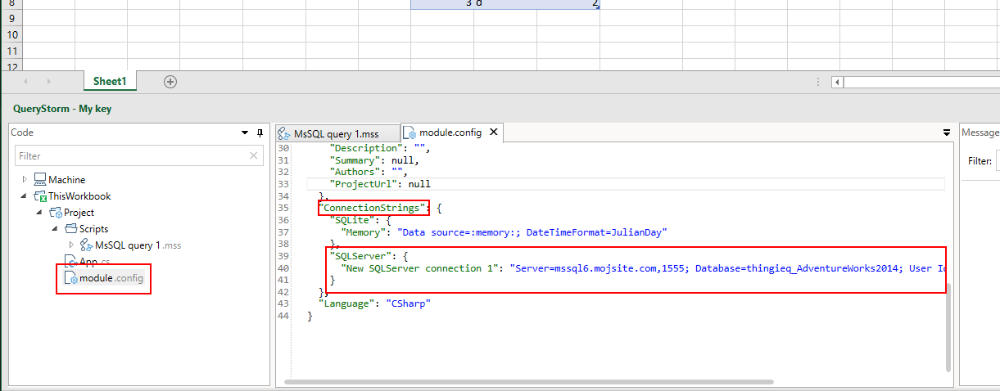

# External databases

QueryStorm supports connecting to external databases, allowing you to query workbook tables alongside database tables. This makes moving data between Excel and databases (in both directions) much easier.

Currently SQL Server, PostgreSQL, MySql, SQLite and Redshift (via Postgres) are supported, while support for other databases may be rolled out in the future depending on user needs and requests.

## Querying
To connect to a database, click the appropriate button from the ***Other** scripts* dropdown menu.


QueryStorm will then prompt you to enter the connection details and select the workbook tables you would like to use in your script. 


When the connection is established, selected workbook tables are automatically copied to the database as temp tables. Once there, they can be queried or imported into permanent tables via SQL.


> While connected, any changes that you make to Excel tables are immediately synchonized to the temp tables. 

Aside from workbook tables, scripts can also see the values of named ranges. These can be used as parameters in your scripts: 


> Only named ranges that refer to a single cell are usable as parameters.

## Fetching data

In the other direction, query results can be written into the workbook and used to create new tables or update existing ones. 

You can write the results of a query into a new or existing table by selecting a cell in Excel and pressing the `Alt+Insert` shortcut key for writing results.

You can also output the results directly from the script, by using the SQL [preprocessor](todo), which is available to all SQL scripts in QueryStorm.

For example, here's how to output the results of a query into an Excel table:
```sql
{@dpt}
SELECT * FROM HumanResources.Department
```   
When this script is executed, the results will be written into an Excel table called *dpt*. If the table does not yet exist, it will be created starting at the currently selected cell. If a table called *dpt* does exists in the current workbook, it will be overwritten by the results of the query. If the workbook table has any columns that are not present in the query results (e.g. calculated columns), those columns will be left intact.

To update multiple tables from the same script, we can use multiple output directives:

```sql
{@dpt}
SELECT * FROM HumanResources.Department

{@people}
SELECT * FROM Person.Person p
```

## Connection strings

When entering connection details, you can give your connection string a name.


The script file stores only the connection name, while the connection string is stored in the `module.config` file:



Referencing the connection string by name (instead of keeping it in the script file) lets scripts that are inside the same project share connection strings. This makes it easier to e.g. redirect all scripts from a development database to a production database.

### Securing credentials

Connection strings can contain sensitive data i.e. database credentials. It's usually not a good idea for developers to share their database credentials with end users. This is an important consideration when sharing the workbook itself or when building and sharing your own [Excel SQL functions](todo).

For this reason, connection strings can be **templated**. Instead of the actual username and password, the developer puts placeholders inside the connection string. 

```
Server=mssql6.mojsite.com,1555; Database=thingieq_AdventureWorks2014; User Id={username:my_creds_123}; Password={password}
```

Two placeholders are supported:
- {username:*the_id_of_the_credentials*}
- {password}

The placeholder for the username must provide the identifier of the credentials. The identifier is used for storing and retrieving the credentials. When a script attempts to connect, if stored credentials with the specified id are not found, the user will be prompted to enter them:


The credentials are then inserted into the connection string template and a connection attempt is made. If the attempt fails, the prompt reappears. If the attempt succeeds, the credentials are encrypted (via the Windows Data Protection API) and stored in a local file for future use. Once the credentials are stored, they are used automatically in the future every time a connection is attempted using a connection string with the same credentials ID. If a connection attempt fails in the future, the user will again be prompted for their credentials. 