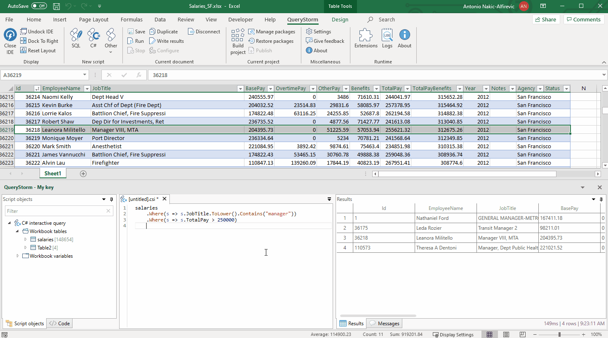
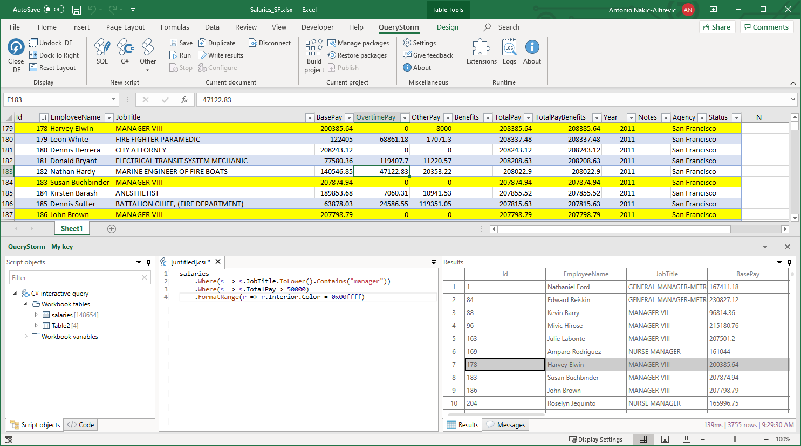

# C# scripts

In QueryStorm, user can write C# scripts that interact with the workbook and the data inside workbook tables. Scripts can query workbook tables using LINQ, interact with the Excel object model or perform other arbitrary tasks.

## Querying tables

One of the main features C# scripts offer is the ability to query tables using LINQ. For each table in the workbook, a variable is provided that gives strongly typed access to the table data.


QueryStorm uses the Reflection.Emit API to dynamically generate classes that represent table rows. This is done on-the-fly, so if you modify Excel tables, QueryStorm will immediately update the generated types.

For example, suppose you have a workbook table named `salaries` that contains data about people's salaries. You could search for people whose salary is greater than 100,000 like so:

```csharp
salaries.Where(s=>s.TotalPay >= 100000)
```

C# scripts can also update data in table. To update a particular row, simply assign new values to its properties. A `ForEach` extension method is also provided to make it easy to update multiple rows:

```csharp
salaries
    .Where(s => s.FirstName == "Marty")
    .ForEach(s => s.TotalPay = s.TotalPay + 2000)
```

Rows can also be deleted individually or in bulk:

```csharp
// individually (Delete single row)
salaries.Single(s => s.Id == 123).Delete()
// in bulk (Delete many rows)
salaries.Where(s => s.TotalPay == 0).Delete()
```

Finally, we can also add rows using `AddRow` and `InsertRow` methods:

```csharp
var row = salaries.AddRow();
row.Id = 123;
row.TotalPay = 123456;
```

## Column names

Table columns in Excel can have names that are not legal C# identifiers. When row properties are generated, characters that are not allowed in C# identifiers are replaced with underscores.

For example, if the table has a column named `Job Title`, the corresponding property will be `Job_Title`:

```csharp
salaries.GroupBy(s => s.Job_Title)
```

Rows also have an indexer property, that allows reading and writing property values by name. The indexer uses the original column name:

``` csharp
dynamic jobTitle = row["Job Title"] // The return type of the indexer is `dynamic`.
```

## Locating rows in Excel

Aside from properties that correspond to columns, rows have an additional `__address` property that can be used to locate rows in Excel. It returns the Excel address of the row. Double-clicking the address in the results grid selects the row in Excel.



Double-clicking the row header in the results grid will also select the range in Excel, provided the row contains a valid address.

## Formatting rows

Aside from locating rows in Excel, the `__address` property can also be used for selectively formatting rows:

```csharp
salaries
	.Where(s => s.JobTitle.ToLower().Contains("manager"))
	.Where(s => s.TotalPay > 50000)
	.Format(range => range.Interior.Color = 0x00ffff) // hex int (B/G/R)
```



## C# scripting syntax

The scripting flavor of C# is supported by Roslyn (the C# compiler) and is slightly different from regular C#. Most of the standard C# syntax is valid in C# scripts, but scripts also allow a more relaxed syntax where you can evaluate expressions, without the ceremony of defining types and methods.

For example, we can return the current date like so:

```csharp
DateTime.Now // do not terminate with ;
``` 
The script will return the result of the last expression in the code, **unless it is terminated with a semicolon**. To return a value from a statement that is not the last statement in the script, an explicit `return` statement is required:

```csharp
return Add(1,2);

public int Add(int a, int b)
{
	return a + b;
}

```

## Referencing dlls

A C# script is hosted inside a project. The project has a `module.config` file that defines library and NuGet references. To use local dlls or NuGet packages in your C# scripts, add them to the host project.

> After adding the references to the project, the script needs to disconnect and reconnect to see the changes.

## Referencing project code

The script can also see the classes that the containing project exposes. The script is not compiled with the project. Rather, it references the project's output dll, so it only sees public types that the project exposes. The project should be built (compiled) before the script can use its types.

> As with references, the script should disconnect and reconnect in order to see changes.

## Interacting with the workbook object

Each C# script has a variable called `ThisProject` that reference the project that contains it. Workbook projects expose a `Workbook` property that exposes the workbook COM object.

From there, the user can interact with the workbook via Excel's COM API.

```csharp
var workbook = ThisProject.Workbook;

// e.g. return the path of the current workbook
workbook.FullName
```
