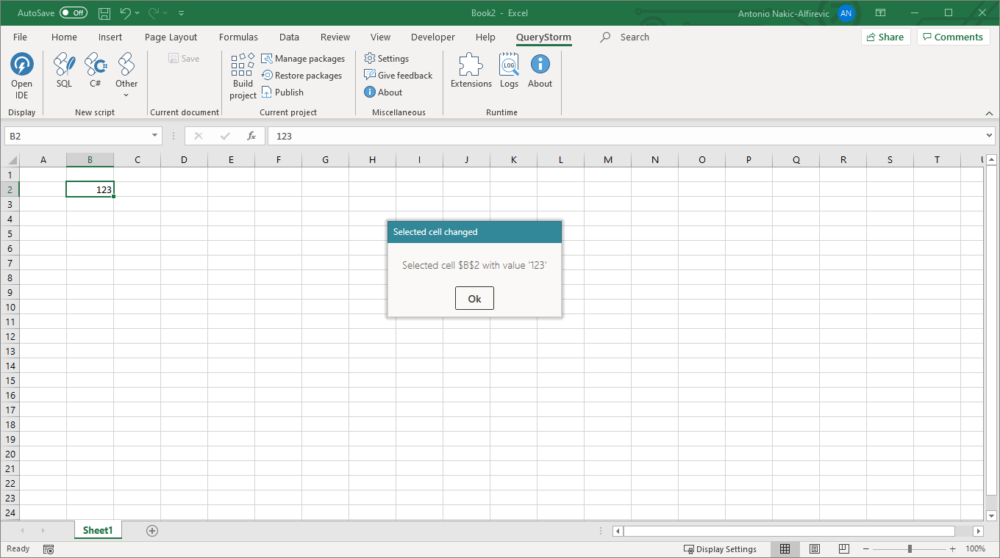

# Automation via COM

A simple way to automate workbooks using C# or VB.NET is to use the Excel COM API. To automate the workbook, we must first add a project to it:


The `Application` class (in [the App.cs file](todo)) is the entry point of the application. In its constructor, we can request a `WorkbookAccessor` instance which will give us access to the workbook that contains the application. We can use the workbook object to read and write cell values, subscribe to events, refresh graphs and pivot tables etc.

For example, the following application will pop up a message box each time the current cell changes:

```csharp
using Microsoft.Office.Interop.Excel;
using QueryStorm.Core;
using QueryStorm.Tools;
using QueryStorm.Core.Excel;
using System;
using Unity;
using static QueryStorm.Tools.DebugHelpers;

namespace Project
{
	public class App : ApplicationModule
	{
		public App(IUnityContainer container, IWorkbookAccessor workbookAccessor, IDialogService dialogService)
			: base(container)
		{
			workbookAccessor.Workbook.SheetSelectionChange +=
				(sh,rng)=>
				{
					dialogService.ShowInfo(
						$"Selected cell {rng.Address} with value '{rng.Value}'",
						"",
						"Selected cell changed");
				};
		}

        protected override Type DefaultDataContextType
        	=> typeof(QueryStorm.Core.Excel.WorkbookDataContext);
	}
}
```

Once we build the project, the runtime will automatically start it, and a dialog box will appear every time we select a different cell in the workbook.



The constructor of the `App` class in this example accepts several parameters which are provided by the QueryStorm runtime via dependency injection. The `workbookAccessor` is used to access the workbook, and the `dialogService` is used to display a message to the user.

With this approach, we deal with the Excel API directly. This is fine for very simple automation scenarios, but if we were building a more complicated application we'd likely need to spend a lot of time writing code that interacts with the Excel object model. For such cases, QueryStorm offers [the model-binding approach](todo) which lets you focus on the business logic instead of on interacting with Excel.
