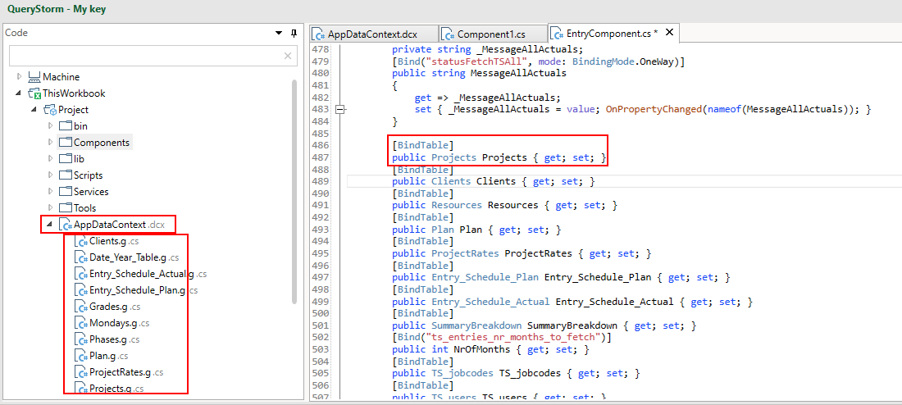

# Model-binding

The model binding approach to building workbook applications is designed to minimize the amount of code needed for interacting with Excel.

Click below for a video example of the model-binding approach:

[](https://youtu.be/DFuTKu6O_9g "Workbook automation via C#")

## The `App` class

The workbook project has an `App` class that's defined in the `App.cs` (or `App.vb`) file. This is the entry point of the application. In most cases, the only thing we need to do in the `App` class is add registrations for any services that might be needed by components.

## Components

A component class contains logic that controls a section of the workbook. You can have any number of components in a workbook, each controlling it's own (arbitrarily defined) part of the workbook.

Components have the following characteristics:

- They can accept dependencies via constructor injection.
- Public properties of a component can be data-bound to cells in Excel via the `[Bind]` attribute and to tables via the `[BindTable]` attribute.
- The methods of the component can handle events coming from Excel (e.g. button click), which is specified using the `[EventHandler]` attribute.

For example, the following component will read input values from two excel cells, and pop up a MessageBox when the user clicks a button:

```csharp
using System;
using System.Collections.Generic;
using System.Linq;
using System.Windows.Forms;
using QueryStorm.Core;
using static QueryStorm.Core.DebugHelpers;

namespace Project
{
	public class Component1 : ComponentBase
	{
		private DateTime date;
		private string name;
		private readonly IDialogService dialogService;
		
        // get the dialogService via constructor injection
		public Component1(IDialogService dialogService)
		{
			this.dialogService = dialogService;
		}
		
		// bind to a cell with the name "name"
		[Bind("name")]
		public string Name
		{
		    get => name;
		    set { name = value; OnPropertyChanged(nameof(Name)); }
		}
		
		// bind to a cell with the name "dateOfBirth"
		[Bind("dateOfBirth")]
		public DateTime Date
		{
		    get => date;
		    set { date = value; OnPropertyChanged(nameof(Date)); }
		}
		
		// handle the click of an ActiveX button
		[EventHandler("Sheet1!CommandButton1")]
		public void Test()
		{
			if(DateTime.Today.Day == Date.Day && DateTime.Today.Month == Date.Month)
				dialogService.ShowInfo($"Well happy birthday to ya, {Name}!", "", "It's your birthday");
			else
				dialogService.ShowInfo($"Hey there {Name}, how's things?", "", "Hello");
		}
	}
}
```

## Bindings

Bindings allow you read and write values from Excel, as well as react to their changes without having to access Excel objects directly or subscribe to their events.

### Bindings and the data context

It's important to note that components aren't bound to Excel directly; they don't actually know anything about Excel. Instead, they are bound to a [data context](todo). For workbook applications, this data context happens to be a `WorkbookDataContext` instance that exposes data and events from the workbook.

The data context allows you to customize the data that components (and scripts) see, to add relations between tables, as well as to create strongly typed classes for accessing table data.

You can add a data context to the project from the project's context menu. Each time you save the data context file, strongly typed classes for tables and their rows will be generated under the data context file. These classes can then be used by components when binding to tables.



### Binding to cells

Component properties can be bound to cells in Excel. This is achieved by using the `[Bind(nameOfCell)]` attribute. The attribute accepts a single parameter that specifies the name of the cell that should be bound to. If the property name is the same as the name of the cell, the argument can be omitted.

By default, bindings work in both directions. When the user enters a new value into a bound cell, the property that the cell is bound to also gets updated. On the other hand, when a bound property's value changes (e.g. in an event handler), it should raise a `PropertyChanged` event by calling e.g. `OnPropertyChange(nameof(MyProperty123))`, which will in turn cause the cell value to update.

### Binding to tables

A component's property can also bind to an Excel table, which is done using the `[BindTable(tableName)]` attribute. This allows the component to read and update table data.

The type of the property should be the class that the data context generated for the table. That class is going to have the same name as the table in Excel.

If you do not care about strongly typed access to the table, the type of the property can be `Tabular`. The `Tabular` class represent a table of data, but it's rows do not offer strongly typed access to the data. Instead, access to data is allowed via indexers  (e.g. `row["column_name"]` instead of `row.column_name`).

To write data to a table, you simply update the table that the property points to. After updating, a call to `table.SaveChanges()` is required to commit changes to Excel.

> In C# scripts, `SaveChanges()` is called automatically, but in model-binding it needs to be explicit.

In the following example, in the `UpdateBirthDayStars` event handler, we're putting a start next to each person's name whose birthday is today:

```csharp
[BindTable]
public People People { get; set; }

[EventHandler]
public void UpdateBirthDayStars()
{
	People.ForEach(p =>
	{
		string nameWithoutStar = p.Name.TrimEnd('*');
		if(p.BirthDate == DateTime.Today)
			p.Name = nameWithoutStar + "*";
		else
			p.Name = nameWithoutStar;
	});

	People.SaveChanges();
}

```

## Events

Public methods of components can handle events coming in from the workbook. To do so, they need to be marked with the `EventHandler` attribute. Multiple `EventHandler` attributes can be applied to a method to handle multiple events.

Currently, the following event sources are supported:

- ActiveX button (Click)
- Range (value changed)
- VBA (sent via the QueryStorm Runtime API)

The event name, which is the single argument to the `EventHandler` attribute, determines which event the method handles. If the method name is the same as the event name, the name of the event can be omitted.

### Handling button click events

When a method needs to handle the click of a button, the following syntax should be used for the event name: `{sheetName}!{buttonName}`.

For example, to handle the click of an ActiveX button named `MyButton` located on a sheet named `Sheet1`, the method should be decorated as follows:

```csharp
[EventHandler("Sheet1!MyButton")]
public void MyEventHandlerMethod()
{
    // ...
}
```

### Handling range value changes

When a method needs to be called every time a range changes, the name of the range should used as the event name:

```csharp
[EventHandler("nameOfTheCell")]
public void MyEventHandlerMethod()
{
    // ...
}
```

### Events from VBA

Events can be sent from VBA code to the workbook application. One reason this might be useful is that it allows using regular buttons to send events, instead of ActiveX buttons which have known issues when changing resolution (e.g. second screen, projector).

To send an event from VBA, use the `QueryStorm.Runtime.API` class:

```vb
CreateObject("QueryStorm.Runtime.API").SendEvent("myEvent")
```

Instances of the `QueryStorm.Runtime.API` class are light weight objects that forward events to the Runtime. They carry no state and do not need to be cached.

## Mixing model-binding with COM automation

Usually components rely on bindings to handle the plumbing of communicating with Excel. If needed, though, the component can also interact directly with the workbook, by requesting an `IWorkbookAccessor` instance in its constructor and accessing its `Workbook` property.
