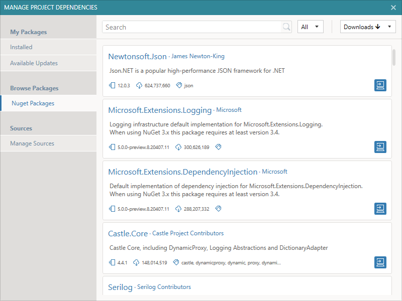
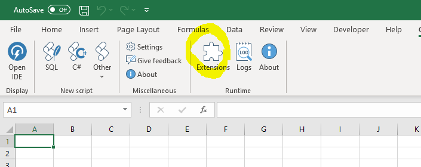
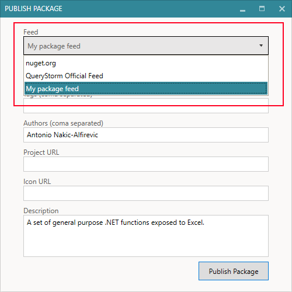
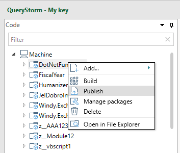
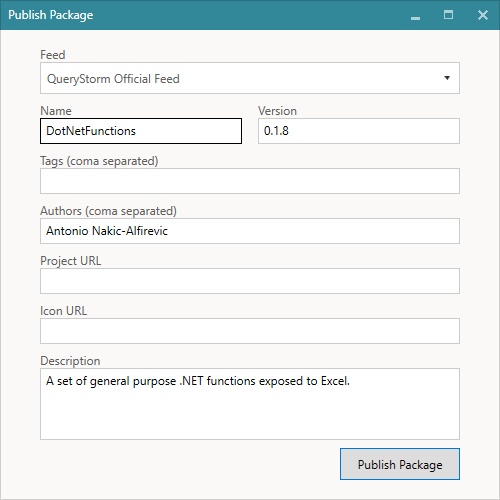

# Managing packages

QueryStorm comes with NuGet support, which serves two purposes:

- Installing NuGet packages into projects
- Sharing QueryStorm extension packages

## NuGet packages

The package manager is used for managing NuGet packages in QueryStorm projects (viewing, installing, uninstalling, updating). 

Installing a package into your project does the following:
- Adds an entry in the `Dependencies` section of the `module.config` file,
- Downloads the package
- Unpacks the contents of the package into the project
  
All dll files contained inside the package are unpacked into the `lib` folder and are automatically referenced.

Since the package contents get stored inside the project, installing NuGet packages into a workbook project will increase the size of the workbook file. Most NuGet packages are fairly small, however, so the increase in size is unlikely to be an issue. The advantage to this is that workbook applications are self-contained and will run on any machine that has the QueryStorm runtime.

## QueryStorm extensions

QueryStorm also uses its NuGet infrastructure for publishing and downloading extension packages. 

Extension packages are created and published from the QueryStom IDE (by package creators), but are installed and used from the QueryStorm Runtime (by end users).

Extension packages are ordinary NuGet packages, but their content is designed to be used by the QueryStorm Runtime. They usually consist of one or more dlls, and an `application.manifest` file that the QueryStorm IDE generates. The manifest file tells the QueryStorm Runtime what the package contains (i.e. list of included functions) and where its entry point is.

A typical scenario for QueryStorm extensions is as follows: 

1. A developer or a consultant uses the QueryStorm IDE to write a set of Excel functions (in C#, VB.NET or SQL) 
2. Once they've prepared the functions, they publish the package to a feed
3. End users install the package using the Extensions manager in the QueryStorm Runtime
4. The end users then use the new functions in their Excel workbooks

## Managing NuGet sources

When publishing a package, you must select the feed to publish the package to:

Once the package is published, your users can browse and install it. In order to see your packages, though, they must have your feed in their list of sources:

The list of feeds is edited in the Package/Extensions Manager dialog as shown above. 

1. Area for managing sources (feeds)
2. Button for editing the feed
3. Feed url or path
4. Feed content type (Packages, Extensions or Both)

> Both creators and consumers use the above dialog to edit their package feeds.

### Types of feeds

If you are distributing packages inside your network, a shared network folder will be a good place to store them. 

In cases where you want to distribute packages to users outside of your local network (e.g. to your clients), you can publish the package to an online NuGet server, like Azure Artifacts ([instructions](../todo)).

When adding a feed, you can specify if the source contains regular NuGet packages, QueryStorm extension packages or both. If you specify that a source contains only regular NuGet packages, the source will not be included when searching for QueryStorm extensions and vice-versa.

Out of the box, two package sources are included:

- Nuget.org
- QueryStorm Extensions Feed 

Nuget.org is the main repository of .NET packages and is used in QueryStorm for installing packages into projects. By default, it's feed type is set to "NuGet packages" so it will not be used when searching for extensions (unless you change its feed type).

The "QueryStorm Extensions Feed" contains only QueryStorm extensions made by our team. It's purpose is to be a place users can download general-purpose extensions from. To publish to this feed, users should request access via our [support email address](mailto:support@querystorm.com). 

For distributing packages to your own clients, as mentioned, you should use a network share or create your own Azure Artifacts feed ([instructions](../todo)). Your clients should add your feed into their list in order to see your the packages.

## Publishing extension packages

To publish an extensions package, follow these steps:
1. Build the project
2. Right-click on the project and select "Publish"
3. Choose the feed to publish to
4. Enter information about the package

When publishing a new version of an existing package, make sure to **increment the version number**, otherwise the server will report a collision with the version that is already on the server. If the repository is a network share, though, there will be no version checks. 

## Publishing to Azure artifacts

Azure Artifacts is a cloud-based package management solution that allows you to create and share NuGet packages via feeds that can be public or private.

Setting up a feed takes just a few minutes and is free of charge. Currently, the free plan allows for up to 2GB of storage, which is enough for thousands of packages and should be more than enough for a long time. Should you need more space, scaling it is quite easy as well. 

To create an Azure artifacts feed, follow the steps below:

1. Go to http://dev.azure.com/ and create an account
2. After signing in, create a new project (**public**)
3. Select the Artifacts tab
4. Click "Create Feed" and give the feed a name
5. Click "Connect to Feed"
6. Click "Visual Studio" and copy the source link
7. Go to QueryStorm in Excel and add a new package source with the url from the previous step

In order to be able to publish to this feed, you'll also need to set up a personal access token, which you can use as the password. To do so, follow these steps:

1. Click on the user settings in the top right corner of the page (in the azure webpage)
2. Select "Personal Access Token"
3. Set token expiration date
4. Grant the token full access
5. Copy the token
6. In QueryStorm, enter the token as the password of the new feed and your email address (that's associated with your Azure account) as the username

That's it. You can now publish to your new feed! The only thing left to do is to share the feed URL with your users so they can add it to their list of sources.

For a video of the entire process, please click below:

