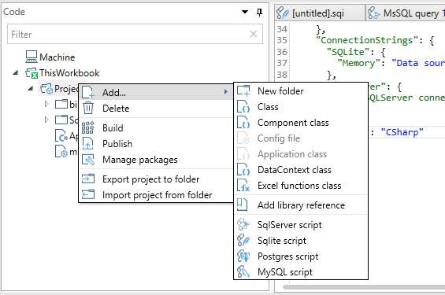

# The QueryStorm project system

Code files in QueryStorm are organized into projects. Projects contain user code, scripts and configuration files, and are fairly similar to projects in Visual Studio.

In order to run the code inside a project, the project needs to be built (compiled). The outputs of the Build process are stored inside the `bin` folder of the project. The outputs will usually consist of the project dll, the debug and documentation files (pdb + xml docs) and a manifest file that's used by the QueryStorm Runtime.

## Two types of projects

There are two kinds of projects in QueryStorm: Workbook projects and Extension projects. 

**Workbook projects** are defined inside a particular workbook and serve to automate the workbook, and to define functions that are specific to the containing workbook. Both the code and as the output files of a workbook project are stored inside the workbook itself.

**Extension projects** are defined at the machine-level, and serve to define functions that should be available in all workbooks. Building (compiling) an extension project produces an extension package. Extension packages can be shared with other users by publishing them to a network share or to an online server. They can be downloaded by end users via the Extensions Manager that's part of the QueryStorm runtime.

## Supported programming languages

QueryStorm projects support source code written in C# and VB.NET. While C# is more popular with developers, VB.NET is more familiar to people with VBA experience. The two languages have a somewhat different syntax, but are practically identical in capabilities. Source code for both languages is compiled using Microsoft's Roslyn compiler.

The selected language of the project is defined in the `module.config` file: 

```json
"Language": "CSharp"
```
The allowed values are "CSharp" and "VisualBasic". Alternatively, you can use the number 1 (without quotes) for C# and 2 for VB.NET. This setting affects the compilation of the project, as well as the class templates that are used when adding new files to the projects.

## Kinds of files

The project system supports the following kinds of files:



- **Class files** (.cs or .vb) contain the logic of your application. Depending on the language of the project, they will have a `.cs` or `.vb` extension.
- **[The Application file]** (`App.cs/App.vb`) file defines the Application class that is the entry point of the application and serves to initialize services, the data context and components. There is a maximum of one `App` file per project.
- **The data context file** defines the tables, variables and events that will be visible to scripts and components. On each save, it generates strongly typed classes for accessing the tables defined inside the context. There is a maximum of one data context file per project.
- **Component files** are ordinary class files generated from a template that provides a skeleton component class that the user can users can use as a starting point for creating their own components
- **Excel function class files** are ordinary class files generated from a template that provides an example implementation of an Excel function, that users can use as a starting point when writing their own Excel functions.
- **Script files** contain SQL and C# scripts (note: VB.NET is not supported for scripting) that process Excel data or fetch data from databases, REST services etc... SQL scripts support a preprocessor syntax that allows defining functions and commands via SQL. Saving a SQL script generates supporting classes that define functions/commands and offer strongly typed access to results.
- The **module.config** file contains the configuration settings for the project, including a list of library and NuGet refernces, selected language (CSharp/VisualBasic), connection strings and project metadata (name, version, etc...).

## Project folders

Files can be organized into more-or-less arbitrary folders. The exception are the two folders that have a special meaning, specifically: `bin` and `lib`.

As mentioned earlies, the `bin` folder contains the build output of the project. It's contents are cleared before each build, so it should not be used to store any user files.

The `lib` folder contains dll files that were added as library references, as well as dll files that have been downloaded as NuGet packages. All dlls inside this folder are automatically referenced and their types can be used in your code, but they are not copied to the `bin` folder during build.

When publishing a package, the package will contain all files from both the `bin` and `lib` folders.

## Libraries and packages

Projects can use existing libraries in two ways:
1. By installing NuGet packages
2. By referencing local dll files


In both cases, dll files are added to the `lib` folder and are immediately referenced by your project.

