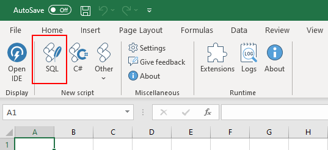
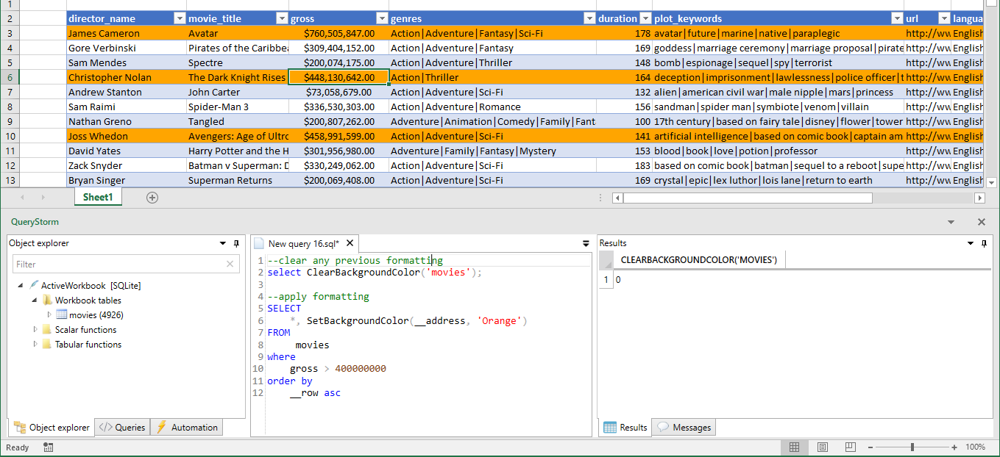

# SQL in Excel
QueryStorm comes equipped with a [SQLite](https://www.sqlite.org) engine that can work with Excel tables as if they were database tables.

## Connecting
Clicking the SQL button in the ribbon pops up the QueryStorm IDE and creates a new SQLite script that you can use to run queries against the tables in the current workbook.



## Querying

Once connected, we can start querying. It's important to note that the SQLite engine will only see data inside [Excel tables](http://www.excel-easy.com/data-analysis/tables.html "Excel tables intro"). 

> To turn a range into a table, select it and press `Ctrl+T`


You can use SQL to **query** as well as **modify** data inside tables. All four SQL data operations are supported: `select`, `insert`, `update` and `delete`. Any changes that your commands make to workbook tables are immediately visible in Excel. 

The default connection is in-memory, so any objects you create in the session (tables, views) are temporary and will disappear as soon as you disconnect.

### The `__address` column
When using the SQLite engine, all workbook tables get an additional column named `__address`. This column contains the original address of the row in Excel. The `__address` column is **hidden**, meaning it is **not included** in the results if you only specify `*` in the select list; you must include it in the select list explicitly if you need it (e.g. `select *, __address...`).

This column is useful for two main reasons:
- Double-clicking the address in the results grid will select the range in Excel
- The address information can be used for formatting ranges from SQL (described below)

## Querying cells 
While the SQLite engine primarily works with Excel tables, it can also work with cells via the **`xlcells()`** table-valued function. 

The following query returns a list of cells in the current selection:
```sql
select * from xlcells()
``` 
We can also return a list of cells in a specified range, like so:
``` sql
select * from xlcells('Sheet1!B5:D9')
```
Here's what the returned data looks like:


For each cell in the selection, one row is returned in the results. Each cell is described with the following attributes: `address`, `row`, `column`, `column letter`, `value`, `type`, `formula`.

You can use this information to search for values or format cells based on criteria that your specify with SQL.

Aside from reading values, the `xlcells` function can also be used for updating. In that case, `xlcells` is used as a table in the `update` query, and its parameter is specified in the `where` clause. 

For example, the follwing query will add 100 to all cells that have a numeric value:

```sql
update
	XLCells -- referenced like a table
set 	
	Value = Value + 100
where 
	targetRangeAddress = 'H6:I8' -- the function's parameter is here (it's visible in autocomplete)
	and Type = 'Double'
```
> Under the hood, table-valued-functions in SQLite are implemented as virtual tables, which can be used both as tables and as tabular functions.


## Formatting rows and cells
Since the SQLite engine is running *in-process* with Excel, it can interact with Excel objects. A typical use case for this is modifying formatting. Two functions are provided for this purpose: `SetBackgroundColor` and `ClearBackgroundColor`.

Here's an example:
``` SQL
--first clear any previous formatting from the 'movies' table (the table name is used as the address)
select ClearBackgroundColor('movies');

--apply new formatting to target rows
select
	*, SetBackgroundColor(__address, 'Orange')
from
	 movies
where
	gross > 400000000
``` 
And the resulting formatting look like this:


> Having the formatting functions in the select list might look a bit peculiar. Formatting functions don't really return any interesting results, but having them in the select list ensures that they have access to rows that satisfy the `where` clause. SQL was not designed for this sort of operation, so unfortunately, there isn't a more appropriate syntax for this.


## Indexing columns
All columns of Excel tables are automatically indexed by the SQLite engine. This makes joins and searches very fast. However, all of the indexes are single-column indexes and no additional indexes can be defined by the user (for workbook tables). 

For representing workbook tables, QueryStorm uses SQLite's virtual table mechanism. Virtual tables have the indexing logic baked in and user defined indexes are not supported. 

If different indexing is needed, you can create a copy of the table and add indexes to the copy, though this is very rarely required.