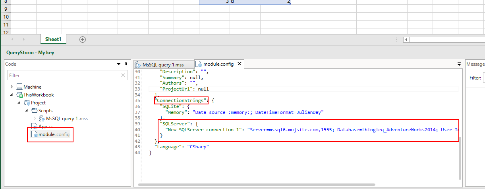
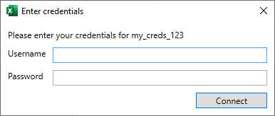

# External databases

QueryStorm supports connecting to external databases, which allows you to query workbook tables alongside existing database tables. This makes moving data between Excel and databases, in both directions, much easier.

Currently SQL Server, PostgreSQL, MySql, SQLite and Redshift (via Postgres) are supported, while support for other databases may be rolled out in future versions depending on user needs and requests.

## Querying
To connect to a database, click the appropriate button from the **Other** scripts dropdown menu.


QueryStorm will then prompt you to enter the connection details and select the workbook tables you would like to use in your script. 


The selected workbook tables will be copied to the database as temp tables. Once there, they can be queried or their data imported into permanent tables via SQL commands.


Aside from workbook tables, scripts can also see the values of (single-celled) named ranges. These can be used as parameters in your scripts: 


## Fetching data

In the other direction, query results can be returned into the workbook and used to create new tables or update existing ones. This is done using the SQL [preprocessor](todo), which is available to all SQL scripts in QueryStorm.

For example, here's how to output the results of a query into an Excel table:
```sql
{@dpt}
SELECT * FROM HumanResources.Department
```   
When this script is executed, the results will be written into an Excel table called *dpt*. If the table does not yet exist, it will be created starting at the currently selected cell. If a table called *dpt* does exists in the current workbook, it will be overwritten by the results of the query. If the workbook table has any columns that are not present in the query results (e.g. calculated columns), those columns will be left intact.

To update multiple tables from the same query, we can use multiple output directives:

```sql
{@dpt}
SELECT * FROM HumanResources.Department

{@people}
SELECT * FROM Person.Person p
```

## Managing connection strings

When entering the connection details, you can give your connection string a name. The scope of the name is the workbook (not the local machine).


The script files only stores the connection name, while the actual connection string is stored in the `module.config` file:



This is done to ensure that multiple scripts in a workbook can use the same connection name, so that you can change the connection string for all of those scripts in one place. 

### Connection string security

Connection strings can contain sensitive data i.e. database credentials. It's usually not a good idea for developers to share their database credentials with end users. This is an important consideration when sharing the workbook itself or when building and sharing your own [Excel SQL functions](todo).

For this reason, connection strings can be **templated**. Instead of the actual username and password, the developer puts placeholders inside the connection string. 

```
Server=mssql6.mojsite.com,1555; Database=thingieq_AdventureWorks2014; User Id={username:my_creds_123}; Password={password}
```

Two placeholders are supported:
- {username:*credId*}
- {password}

The placeholder for the username must provide the identifier of the credentials, so they can be stored. 

When the user attempts to use a script with a templated connection string for the first time, they will be prompted to enter their database credentials:



The entered user credentials are then inserted into the template and a connection is attempted. If the attempt fails the prompt reappears. If the attempt succeeds, the credentials are encrypted (via the Windows Data Protection API) and stored in a local file for future use. After the credentials are stored, they are used automatically in the future every time a connection is attempted using a connection string with the same credentials ID. If a connection attempt fails in the future, the user will again be prompted for their credentials. 