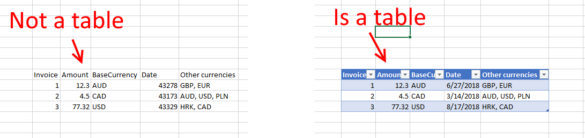
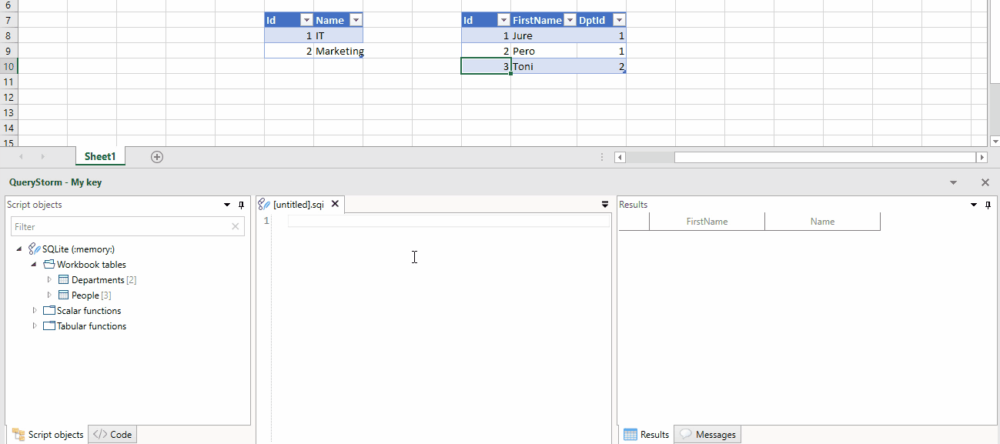
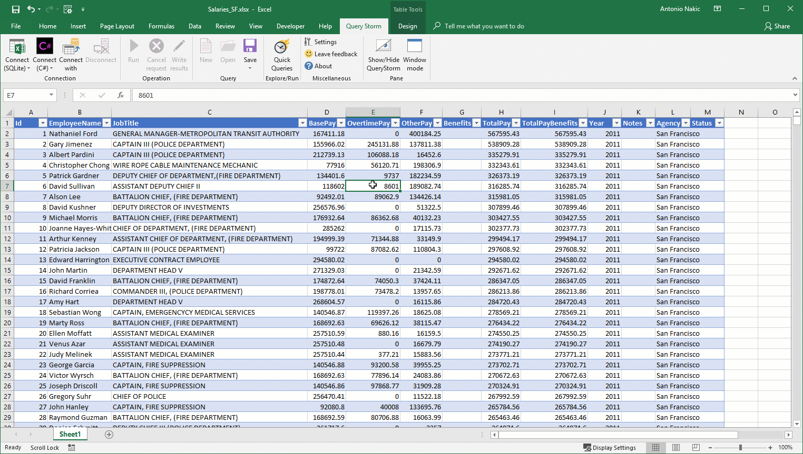

# Querying

Querying data is one of the three main areas of QueryStorm, alongside [creating custom functions](todo) and [automating workbooks](todo). 

QueryStorm supports writing SQL and C# scripts that can see Excel tables, and work with data as if it was in a database (SQL) or in a. collection (C#). 

## Tables, not sheets
It's important to note that QueryStorm scripts work with [Excel tables](https://support.office.com/en-us/article/overview-of-excel-tables-7ab0bb7d-3a9e-4b56-a3c9-6c94334e492c "Excel tables"), and not with ranges or sheets.

!!! Note
	Press Ctr+T on a cell or a block of cells to convert it to a table.

## SQL querying

QueryStorm comes with a built-in SQLite engine that can work with workbook tables as if they were regular database tables. 

You can run any valid SQLite query on your data, including `UPDATE`, `INSERT` and `DELETE` statements. 

Read more about the SQL support [here](todo).

## External databases

Aside from the built-in SQLite engine, you can also connect to external databases. As you connect, you can choose which tables will be imported into the database as temp tables and thus made available to your scripts. 

This makes importing, exporting and combining database and spreadsheet data very easy. Additionally, it also allows you to make use of any specific capabilities that the database server offers, to query your workbook tables.

To connect to an external database, choose the appropriate script type in the **Other** scripts dropdown in the ribbon. 

A dialog will appear allowing you to enter the database connection settings and choose the tables to be included in the session as temp tables.

Read more about working with external databases [here](todo).

## Querying with C# #
Lastly, QueryStorm also allows querying data via C#. Tables are represented as a collection of strongly typed objects that you can query and modify. 

Types that represent table rows are dynamically generated by QueryStorm (via Reflection.Emit), so any changes you make to your workbook tables (e.g. adding a new column) are immediately reflected in your C# scripts.

Read more about QueryStorm's C# support [here](../csharp/querying).
