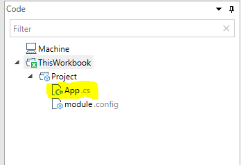

# The App class

In QueryStorm, you can define projects inside your workbook, or outside of it (in a local folder). Projects defined inside the workbook serve to automate the workbook and define functions that are only available inside that particular workbook. Projects that are defined outside of a workbook serve to define functions that should be usable in any Excel workbook. 

Each project is a small **application** that the QueryStorm runtime runs and manages. The `App` class is the entry point to this application. 



If your project does not define an `App` class explicitly, a default `Application` instance is used implicitly.

When loading the module, the Runtime will create a single instance of the `App` class. It is the job the `App` class to initialize the application i.e. to register services, create and initialize the data context and components. 

The constructor of the App class is the first method that runs when the QueryStorm runtime loads the application. In it, you can do any initialization logic that your applications needs. Applications support dependency injection, and you should use this constructor to register any services that your application needs. 

## Dependency Injection

The App class can request certain services from the QueryStorm Runtime. These services are injected as constructor arguments using a Unity IOC container.

For example, if your application needs to interact with the workbook, it can request the `IWorkbookAccessor` service, by adding it to the list of constructor arguments, like so:

```csharp
public App(IUnityContainer container, IWorkbookAccessor workbookAccessor)
			: base(container)
{
    var workbook = workbookAccessor.Workbook;
    // todo: do something with the Workbook object 
}
```

The following services are registered with the container out of the box (by the QueryStorm Runtime):
- `IExcelAccessor`: allows access to the current Excel Application instance.
- `IWorkbookAccessor`: Allows access to the workbook that contains the application (defined only for Workbook applications).
- `IDialogService`: allows showing dialog messages to the user, using the QueryStorm style of dialog windows and ensuring that Excel is set as the owner of the dialog windows.
- `CredentialsVault`: gives access to the current user's encrypted connection credentials. This is primarily used by SQL scripts and related classes.

If any other services are required by your application, you should register them with the container in the constructor of the `App` class. Since the container instance belongs to your application, the changes that you make to it will not affect anything outside of your application. 


## Workbook applications

QueryStorm lets you automate your workbooks with C# or VB.NET code. This offers many advantages compared to using VBA, most notably better language features and access to the .NET ecosystem via NuGet packages.

In addition, QueryStorm offers strongly typed access to Excel tables, and a model-binding API that lets you concentrate on your business logic instead of on communicating with Excel. 

### Automation via COM

As mentioned before, the `App` class is the entry point of the appliction. In its constructor, we can request a `WorkbookAccessor` instance which will give us access to the workbook that contains the application.

We can use the workbook object to read and write cell values, subscribe to events, refresh graphs and pivot tables etc.

For example, the following application will pop up a messagebox each time the current cell changes:

```csharp
using Microsoft.Office.Interop.Excel;
using QueryStorm.Core;
using QueryStorm.Tools;
using QueryStorm.Core.Excel;
using System;
using Unity;
using static QueryStorm.Tools.DebugHelpers;

namespace Project
{
	public class App : ApplicationModule
	{
		public App(IUnityContainer container, WorkbookAccessor workbookAccessor, DialogService dialogService)
			: base(container)
		{
			workbookAccessor.Workbook.SheetSelectionChange += 
				(sh,rng)=> 
				{ 
					dialogService.ShowInfo(
						$"Selected cell {rng.Address} with value '{rng.Value}'", 
						"Selected cell changed");
				};
		}

        protected override Type DefaultDataContextType 
        	=> typeof(QueryStorm.Core.Excel.WorkbookDataContext);
	}
}
```

Admittedly, this is quite annoying behavior, so we may want to remove the event handler and rebuild the appliction. At that point, the previous version of the application will be shut down and it's appdomain unloaded, so there's no need for us to worry about unsubscribing event.

With this approach, we deal with the Excel API directly. The downside of this approach is that we're likely to spend a lot of time writing code that interacts with the Excel object model. That's why QueryStorm offers the model-binding approach.

### Automation via model-binding

The model binding approach to building workbook applications is designed to minimize the amount of code you need to write to interact with Excel. 

With this approach, most of the business logic resides inside **component** classes. A component class handles the logic that controls part of the workbook. You can have any number of controllers in a workbook, each controlling it's own (arbitrarily defined) part of the workbook.

A component accepts dependencies via constructor injection. The parameters of a component can be data-bound to cells in Excel via the `[Bind]` attribute. The methods of the component can handle events coming from Excel (e.g. button click, cell change), which is specified using the `[EventHandler]` attribute.

For example, the following component will pop up a messagebox whose text depends on the values of two Excel cells:

```csharp
using System;
using System.Collections.Generic;
using System.Linq;
using System.Windows.Forms;
using QueryStorm.Core;
using QueryStorm.Tools;
using static QueryStorm.Tools.DebugHelpers;

namespace Project
{
	public class Component1 : ComponentBase
	{
		private DateTime date;
		private string name;
		private readonly IDialogService dialogService;
		
		public Component1(IDialogService dialogService)
		{
			this.dialogService = dialogService;
		}
		
		// binds to a cell with the name "name"
		[Bind("name")]
		public string Name
		{
		    get => name; 
		    set { name = value; OnPropertyChanged(nameof(Name)); }
		}
		
		// binds to a cell with the name "dateOfBirth"
		[Bind("dateOfBirth")]
		public DateTime Date
		{
		    get => date; 
		    set { date = value; OnPropertyChanged(nameof(Date)); }
		}	
		
		// handles the click of an ActiveX button
		[EventHandler("Sheet1!CommandButton1")]
		public void Test()
		{
			if(DateTime.Today.Day == Date.Day && DateTime.Today.Month == Date.Month)
				dialogService.ShowInfo($"Well happy birthday to ya, {Name}!", "It's your birthday");
			else
				dialogService.ShowInfo($"Hey there {Name}, how's things?", "Heya");
		}
	}
}
```
For a video demonstrating the creation and result of the component, click below:

[](https://youtu.be/DFuTKu6O_9g "Workbook automation via C#")

The component can interact directly with Excel if it needs to, by requesting a `WorkbookAccessor` object, but usually it will just contain the business logic and rely on bindings to handle the plumbing of communicating with Excel.

It's important to note that components aren't directy bound to Excel. Instead they are bound to a data context. For workbook applications, this data context (the `WorkbookDataContext`) exposes data and events from the workbook. If you need to customize the data context, you should specify your own data context in the project.

## Extension applications

Extension applications are defined inside projects at the machine level. 

The only purpose of extension projects (for now) is to define a set of custom Excel functions that you can use in any workbook, and that you can share as a package to other (QueryStorm runtime) users. 

Even though they only hold functions, they are loaded by the QueryStorm runtime in the exact same way as Workbook applications. They have an `App` class that they can use to register dependencies that the functions can share.
If it's a commercial package, we can also check for a valid license to make sure the user is licensed to use the package.


## Application lifetime
The runtime is responsible for loading applications. Each applications is loaded into a separate `AppDomain`, ensuring a level of separation between different user applications. 

Applications can be defined at the workbook level (Workbook applications) and at the machine level (Extension applications).

A Workbook application is loaded as soon as the workbook (that contains it) is opened, and is unloaded as soon as the workbook is closed.

Extension applications are loaded when Excel opens, and are unloaded when Excel closes. They are not affected by workbooks being opened or closed. Additionally, when an extension package is downloaded via the Extensions manager, it is immediatelly loaded. When it is removed via the Extensions manager it is immediately unloaded.

Both Workbook and Extension applications are reloaded each time a new version of the applciation is built by the IDE. When the IDE successfully builds a project, it sends a message to the Runtime to inform it that a new module has been prepared, and the Runtime immediatelly attempts to load it, after terminating any previously running instances of the same application. 

When unloading, the appdomain that held the App instance is destroyed, so you don't need to worry about cleaning.
