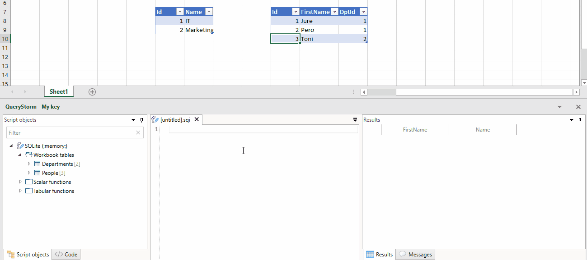
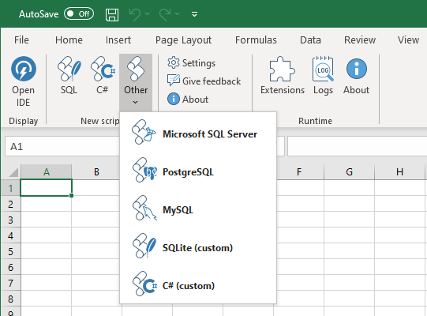
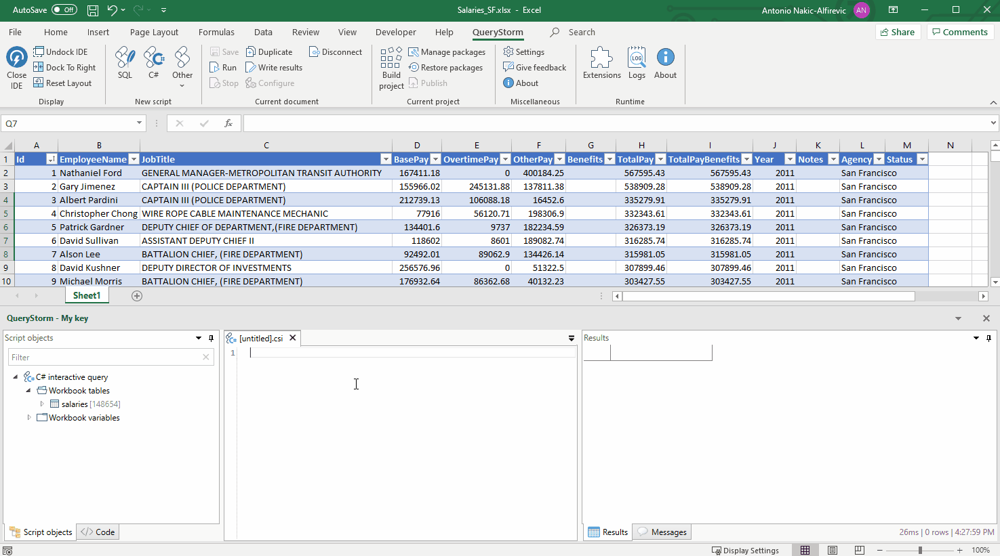

# Querying

QueryStorm supports writing SQL and C# scripts that can see Excel tables, and work with data as if it was in a database (SQL) or in a .NET collection (C#).

## Tables, not sheets

It's important to note that QueryStorm scripts work with [Excel tables](https://support.office.com/en-us/article/overview-of-excel-tables-7ab0bb7d-3a9e-4b56-a3c9-6c94334e492c "Excel tables"), and not with ranges or sheets.

> Press Ctr+T on a cell or a block of cells to convert it to a table.

## SQL querying

QueryStorm comes with a built-in SQLite engine that can work with workbook tables as if they were regular database tables.

You can run any valid SQLite query on your data, including `UPDATE`, `INSERT` and `DELETE` statements.

Visit the [SQLite section](todo) for more information.

## External databases

Aside from the built-in SQLite engine, you can also connect to external databases. As you connect, you can choose which tables will be imported into the database as temp tables and thus made available to your scripts. This makes it very easy to move data between Excel and databases.

To connect to an external database, choose the appropriate script type in the ribbon.

A dialog will appear allowing you to configure the connection and select the tables that should be included in the session as temp tables.

Read more about working with external databases [here](todo).

## Querying with C# #

QueryStorm also allows querying data via C#. Tables are represented as collections of strongly typed objects that you can query and modify.

Types that represent table rows are dynamically generated, allowing for strongly typed access to the data. Any changes you make to your workbook tables (e.g. adding a new column or a new table) are immediately reflected in your C# scripts.

Read more about QueryStorm's C# scripting support [here](../csharp/querying).

<!--
# Scripting
## connecting/disconnecting
## Data context
## duplicating
## interaction with the project
## adding sqlite functions
## exposing types to C# scripts
## no VB.NET support
-->
