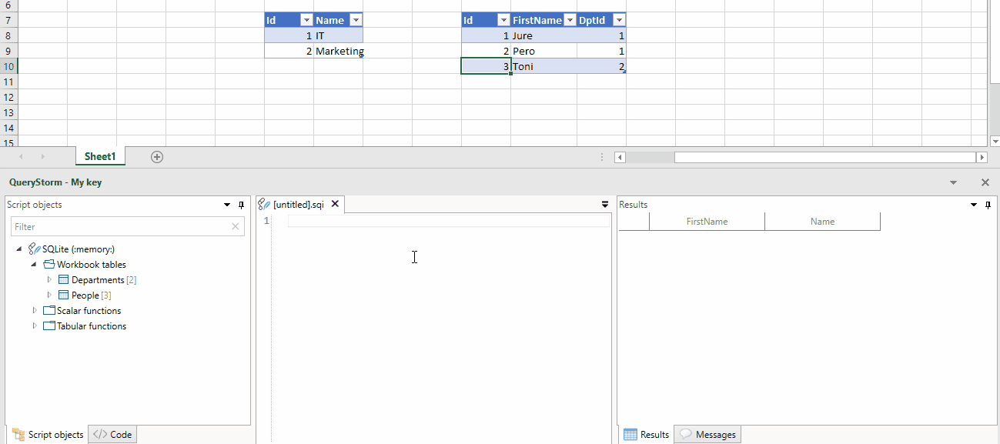
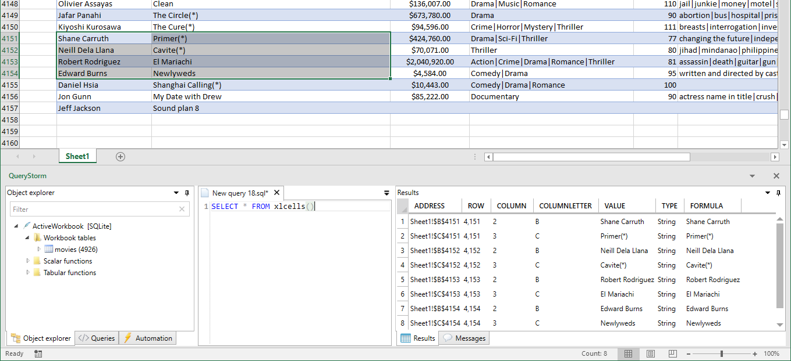

# SQLite

QueryStorm comes equipped with a [SQLite](https://www.sqlite.org) engine that can work with Excel tables as if they were database tables.

## Connecting

Clicking the SQL button in the ribbon pops up the QueryStorm IDE and creates a new SQLite script that you can use to run queries against the tables in the current workbook.


## Querying

Once connected, we can start querying. It's important to note that the SQLite engine will only see data inside [Excel tables](http://www.excel-easy.com/data-analysis/tables.html "Excel tables intro"). Data that isn't marked as a table will not be visible.

> To turn a range into a table, select it and press `Ctrl+T`



You can use SQL to **query** and **modify** data inside tables. All four SQL data operations are supported: `select`, `insert`, `update` and `delete`. Any changes that your commands make to the data inside workbook tables will be immediately visible in Excel.

### The `__address` column

When using the SQLite engine, all workbook tables get an additional column named `__address`. This column contains the original address of the row in Excel. The `__address` column is **hidden**, meaning it is **not included** in the results if you only specify `*` in the select list; you must include it in the select list explicitly if you need it (e.g. `select *, __address from...`).

This column is useful for two main reasons:

- Double-clicking the address in the results grid will scroll to the range in Excel and select it
- The address information can be used for formatting ranges from SQL (described below)

## Querying cells

While the SQLite engine primarily works with Excel tables, it can also work with cells via the **`xlcells()`** table-valued function. This is primarily useful when working with unstructured data.

The following query returns a list of cells in the current selection:

```sql
select * from xlcells()
```

We can also return a list of cells in a specified range, like so:

``` sql
select * from xlcells('Sheet1!B5:D9')
```

Here's what the returned data looks like:


For each cell in the selection, one row is returned in the results. Each cell is described with the following attributes: `address`, `row`, `column`, `column letter`, `value`, `type`, `formula`. We can use this information to search for cells that satisfy a particular criteria.

Aside from reading, the `xlcells` function can also be used for updating cell values. In that case, `xlcells` is used as a table in the `update` query, and its parameter is specified in the `where` clause.

For example, the following query will add 100 to all cells in a range that have a numeric value:

```sql
update
	XLCells -- referenced like a table
set
	Value = Value + 100
where
	targetRangeAddress = 'H6:I8' -- the function's parameter is here (it's visible in autocomplete)
	and Type = 'Double'
```

> Under the hood, table-valued-functions in SQLite are implemented as virtual tables. Virtual tables can be referenced using the table syntax or the function syntax. When using the table syntax (as shown above), the function's parameters are specified in the `WHERE` clause.

## Formatting rows and cells

Since the SQLite engine is running *in-process* with Excel, it can interact with Excel objects. A typical use case for this is modifying formatting. Two functions are provided for this purpose: `SetBackgroundColor` and `ClearBackgroundColor`.

Here's an example:

```sql
--first clear any previous formatting from the 'movies' table (the table name is used as the address)
select ClearBackgroundColor('movies');

--apply new formatting to target rows
select
	*, SetBackgroundColor(__address, 'Orange')
from
	 movies
where
	gross > 400000000
```

And the resulting formatting look like this:


We can use the same approach to set the background color of individual cells:

```sql
select ClearBackgroundColor('a1:d10');

select
	*, SetBackgroundColor(Address, 'Orange')
from
	 xlcells('a1:d10') x
where
	x.Type = 'Double'
```

> Having the formatting functions in the select list might look peculiar. Formatting functions don't return any interesting results, but having them in the select list ensures that they have access to rows that satisfy the `where` clause. SQL was not designed for imperative code, so unfortunately, there isn't a more appropriate syntax for this.

### Bulk formatting

Formatting row-by-row or cell-by-cell can be quite slow (~1s for 1k rows). When formatting tens of thousands of rows, it's faster to group them together and apply formatting in bulk. For that purpose, you can use the `group_address` function. This is an **aggregate** function that converts a group of addresses into a single address with a special syntax. Formatting functions understand this syntax and and can use it to minimize the number of calls to Excel that are needed to preform the formatting.

The only change that's needed in the query is to wrap the __address column with the `group_address` function:

```sql
select
	*, SetBackgroundColor(group_address(__address), 'Orange')
from
	 movies
where
	gross > 400000000
```

This small change in the query can make formatting 10k rows take ~200ms instead of ~10s.

## Indexing columns

All columns of Excel tables are automatically indexed by the SQLite engine. This makes joins and searches very fast. However, all of the indexes are single-column indexes and no additional indexes can be defined by the user (for workbook tables).

This is because QueryStorm uses SQLite's "virtual table" mechanism for representing workbook tables. Virtual tables have the indexing logic baked in and user defined indexes are not supported.

If different indexing is needed, you can create a copy of the table and add indexes to the copy, though this is rarely required.
