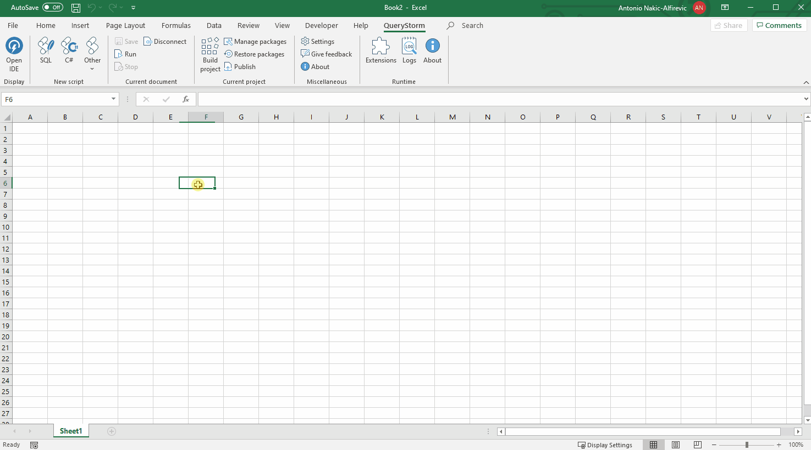

# Custom Excel functions

QueryStorm enables user to add new functions to Excel. Users who use the full version of QueryStorm can build their own custom functions as well as publish them to other users. Users who use the Runtime version of QueryStorm can install packages published by creators, but cannot create their own functions.



## Where functions are stored

Functions can be defined inside a particular **workbook** or in an **extension package**.

### Functions in the workbook

Functions that are defined inside a workbook are only available to that workbook. The advantage to this is that they will be immediately available to others when they open a copy of your workbook (provided they have the QueryStorm runtime), so you don't need to distribute them separately.

### Functions in an extension package

Functions can also be defined in *extension packages*. Functions contained in an extension package are usable in any workbook on the machine. Authors can easily publish their extension packages  to make them available to other (QueryStorm Runtime) users. Click [here](todo) for more information about publishing extension packages.

## Supported languages

QueryStorm lets you define new Excel functions using **SQL**, **C#** and **VB.NET**.

### Creating functions via SQL

Defining functions in SQL is useful for returning data from databases. The function body is written in SQL, while the function declaration uses a simple preprocessor syntax that's available in all SQL scripts in QueryStorm.

For example:
```sql
-- the declaration of the function
{function searchPeople(string searchTerm = "tim")}

-- the body of the function
select
	*
from
	Person.Person p
where
	p.FirstName like '%' + @searchTerm + '%'
```

To read more about creating functions with SQL, click [here](todo).

### Creating functions via C# and VB.NET

Building functions in C# and VB.NET is a matter of writing the code of the function and decorating it with the `ExcelFunction` attribute. The function might perform a calculation on its own, or it might call into some third party library or a REST service.

For example:

```csharp
public class MyFunctions
{
	[ExcelFunction]
	public static int Add(int a, int b)
	{
		return a + b;
	}
}
```

The user can choose the language (C# or VB.NET) they wish to use in the `module.config` file. To read more about creating functions with C# and VB.NET, click [here](todo).
