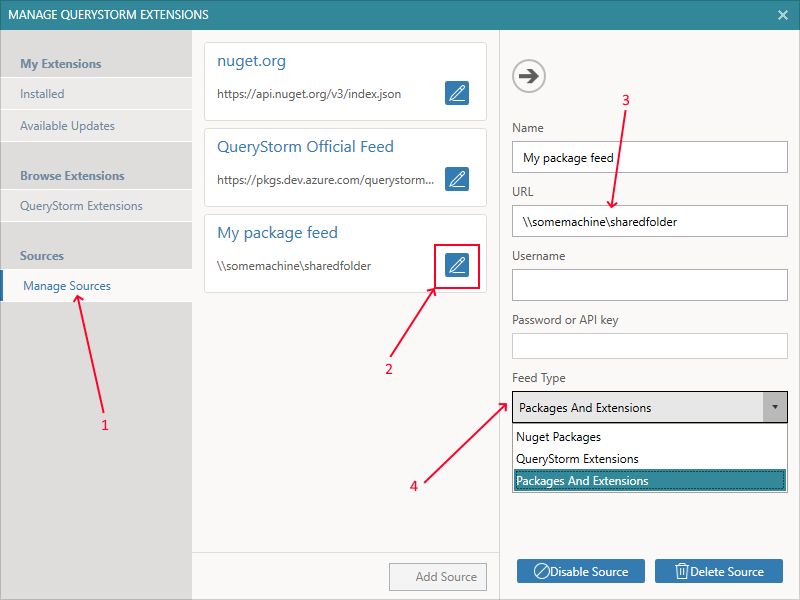

# Installing packages

Extension packages are created and published from the QueryStorm IDE by package creators, and are installed and used from the QueryStorm Runtime by end users. An extension package contains one or more custom Excel functions. 

A typical scenario for QueryStorm extensions is as follows:

1. A developer or a consultant uses the QueryStorm IDE to write a set of Excel functions (in C#, VB.NET or SQL) for a particular purpose
2. Once they've prepared the functions, they publish the package that contains them to a feed
3. End users install the package using the Extensions manager in the QueryStorm Runtime
4. The end users then use the new functions in their Excel workbooks

## Managing NuGet sources

Package creators publish packages to a feed. This is typically a feed that's owned by the package creator. In order to be able to browse packages that a creator has prepared, you must add their feed into your list of feeds. The creator is responsible for providing you the with the URL to their feed.

Once you have the URL, you can add it to your list of feeds. The list of feeds is edited in the **Extensions Manager** dialog as shown below.

1. Area for managing sources (feeds)
2. Button for editing the feed
3. Feed url or path
4. Feed content type (Packages, Extensions or Both)

> Both creators and consumers use the above dialog to edit their package feeds.