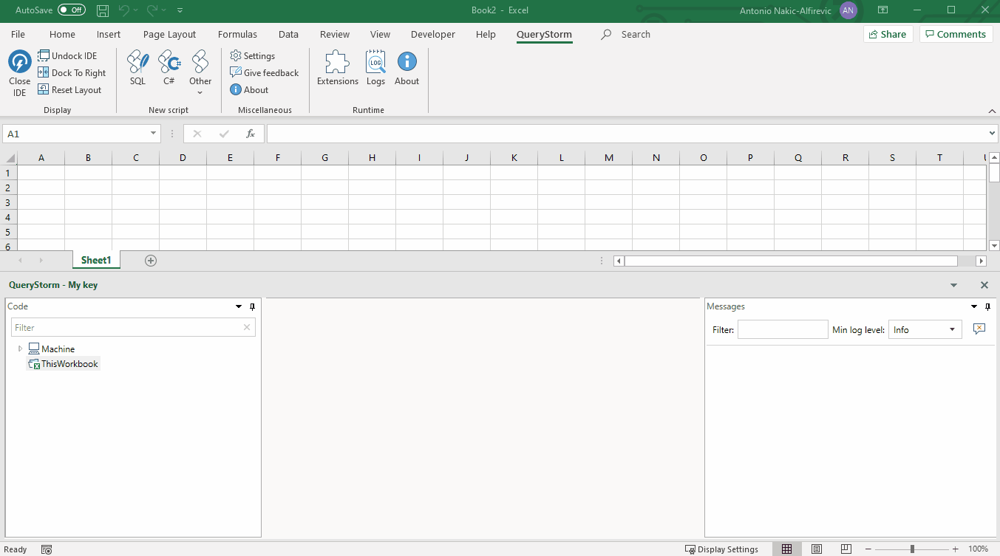
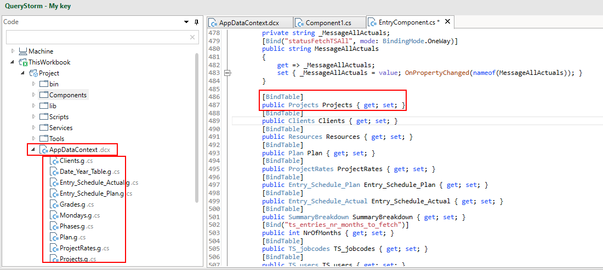

# Workbook automation with .NET

QueryStorm allows using C# and VB.NET, instead of VBA, to automate Excel workbooks.

It offers a model binding approach that is designed to minimize the amount of code that's needed to interact with Excel, although automation via the Excel COM API is also fully supported.

Click below for a video example of the model-binding approach:


## Creating the project

To automate the workbook, we must first add a project to it:



This will create a project and prepare `module.config` and `app.cs` files that we can use as the starting point for out workbook application.

When this project is built, the output files (.dll and .manifest) will be stored inside the workbook, and the runtime will automatically load the project.

Each time an Excel workbook is opened, the QueryStorm runtime inspects it to see if there's a compiled workbook application inside it. If it finds one, it loads it along with the workbook. When the workbook is closed, the application is unloaded with it.

## The `App` class

The workbook project has an `App` class that's defined in the `App.cs` (or `App.vb`) file. This is the entry point of the application.

In its constructor, we can request a `WorkbookAccessor` instance which will give us access to the workbook that contains the application. We can use the workbook object to read and write cell values, subscribe to events, refresh graphs and pivot tables etc.

For example, we can pop up a message box each time a cell is selected (though admittedly, this is not a very useful thing to do):

```csharp
public App(IUnityContainer container, IWorkbookAccessor workbookAccessor, IDialogService dialogService)
	: base(container)
{
	workbookAccessor.Workbook.SheetSelectionChange +=
		(sh,rng)=>
		{
			dialogService.ShowInfo(
				$"Selected cell {rng.Address} with value '{rng.Value}'",
				"",
				"Selected cell changed");
		};
}
```

In most cases, however, it's better to leave Excel interactions to QueryStorm's model binding infrastructure, and only use the COM API in special cases.

### Dependency injection

The constructor of the `App` class in the example above, accepts several parameters which are provided by the QueryStorm runtime via dependency injection. The `workbookAccessor` service is used to access the workbook, and the `dialogService` is used to display a message to the user.

Each workbook application is provided (by the QueryStorm runtime) its own IOC container, which comes pre-populated with some basic services. It is the responsibility of the `App` class to register any additional services that other parts of the application might need.

For example:
```csharp
public App(IUnityContainer container)
	: base(container)
{
	// register a service (as a singleton)
    container.RegisterType<SomeService>(new ContainerControlledLifetimeManager());
}
```

The IOC container is used to create instances of other classes, such as the data context, components and function container classes, so all of those classes can accept dependencies via their constructors.

For example:

```csharp
public class Component1
{
    public Component1(SomeService someService)
	{
		// ...		
	}
}
```

> QueryStorm uses the [Unity container](http://unitycontainer.org/articles/introduction.html) for dependency injection.

## Components

A component class contains logic that controls a section of the workbook. You can have any number of components in a workbook, each controlling it's own (arbitrarily defined) part of the workbook.

Components have the following characteristics:

- They can accept dependencies via constructor injection.
- Public properties of a component can be data-bound to cells in Excel via the `[Bind]` attribute and to tables via the `[BindTable]` attribute.
- The methods of the component can handle events coming from Excel (e.g. button click), which is specified using the `[EventHandler]` attribute.

For example, the following component reads a `searchText` parameter from a cell in Excel. Each time that parameter changes, it updates the names of people in a table, and writes a text into a `messages` cell:

```csharp
using System;
using System.Collections.Generic;
using System.Linq;
using System.Windows.Forms;
using QueryStorm.Core;
using static QueryStorm.Core.DebugHelpers;

namespace Project
{
	public class Component1 : ComponentBase
	{
		[Bind("searchText")]
		public string SearchText { get; set; }
		
		[BindTable]
		public People People{ get; set; }
		
		private string _Message;
		[Bind("messages")]
		public string Message
		{
		    get => _Message; 
		    set { _Message = value; OnPropertyChanged(nameof(Message)); }
		}
		
		[EventHandler("searchText")]
		public void Test()
		{
			Message = $"Searched for '{SearchText}' at {DateTime.Now.ToShortTimeString()}";

			People.ForEach(t =>
			{
				string nameWithoutStar = t.FirstName.TrimEnd('*');
				if(t.FirstName.IndexOf(SearchText, StringComparison.OrdinalIgnoreCase) >= 0)
					t.FirstName = nameWithoutStar + "*";
				else
					t.FirstName = nameWithoutStar;
			});

			People.SaveChanges();
		}
	}
}
```

And here is the resulting behavior:


The important thing to note is that no part of the code interacts with Excel directly. The component only accesses its own properties, and the binding infrastructure takes care of communication with Excel.

## Bindings

Bindings allow you to read and write values from Excel without having to access Excel objects directly or subscribe to their events to listen for changes.

### Bindings and the data context

It's important to note that components aren't bound to Excel directly; they don't actually know anything about Excel. Instead, they are bound to a [data context](todo). For workbook applications, this data context happens to be a `WorkbookDataContext` instance that exposes data and events from the workbook.

The data context allows you to customize the data that components (and scripts) see, to add relations between tables, as well as to create strongly typed classes for accessing table data.

You can add a data context to the project from the project's context menu. Each time you save the data context file, strongly typed classes for tables will be generated under the data context file. These classes can then be used by components when binding to tables.



### Binding to cells

Component properties can be bound to cells in Excel. This is achieved by using the `[Bind(nameOfCell)]` attribute. The attribute accepts a single parameter that specifies the name of the cell that should be bound to.

By default, bindings work in both directions. When the user enters a new value into a bound cell, the property that the cell is bound to also gets updated. On the other hand, when a bound property's value changes (e.g. in an event handler), the component should raise a `PropertyChanged` event by calling e.g. `OnPropertyChange(nameof(MyProperty123))`, which will in turn cause the cell value to update.

### Binding to tables

A component's property can also bind to an Excel table, which is done using the `[BindTable(tableName)]` attribute. This allows the component to read and update table data.

The type of the property should be the class that the data context generated for the table. That class is going to have the same name as the table in Excel.

If you do not care about strongly typed access to the table, the type of the property can be `Tabular`. The `Tabular` class represent a table of data, but it's rows do not offer strongly typed access to the data. Instead, access to data is allowed via indexers  (e.g. `row["column_name"]` instead of `row.column_name`).

To update data in an Excel table, you simply update the data in the table instance and call `table.SaveChanges()` to commit changes to Excel.

> In C# scripts, `SaveChanges()` is called automatically, but in model-binding it needs to be explicit.

## Events

Public methods of components can handle events coming in from the workbook. To do so, they need to be marked with the `EventHandler` attribute. Multiple `EventHandler` attributes can be applied to a method in order to handle multiple events.

Currently, the following event sources are supported:

- ActiveX button (Click)
- Range (value changed)
- VBA (sent via the QueryStorm Runtime API)

The event name, which is the single argument to the `EventHandler` attribute, determines which event the method handles. 

### Handling button click events

When a method needs to handle the click of a button, the following syntax should be used for the event name: `{sheetName}!{buttonName}`.

For example, to handle the click of an ActiveX button named `MyButton` located on a sheet named `Sheet1`, the method should be decorated as follows:

```csharp
[EventHandler("Sheet1!MyButton")]
public void MyEventHandlerMethod()
{
    // ...
}
```

### Handling range value changes

When a method needs to be called every time a range changes, the name of the range should used as the event name:

```csharp
[EventHandler("nameOfTheCell")]
public void MyEventHandlerMethod()
{
    // ...
}
```

### Events from VBA

Events can be sent from VBA code to the workbook application. One reason this might be useful is that it allows using regular buttons to send events, instead of ActiveX buttons which have known issues when changing resolution (e.g. second screen, projector).

To send an event from VBA, use the `QueryStorm.Runtime.API` class, like so:

```vb
CreateObject("QueryStorm.Runtime.API").SendEvent("myEvent")
```

Instances of the `QueryStorm.Runtime.API` class are lightweight objects that forward messages to the QueryStorm Runtime. They carry no state and do not need to be cached.
