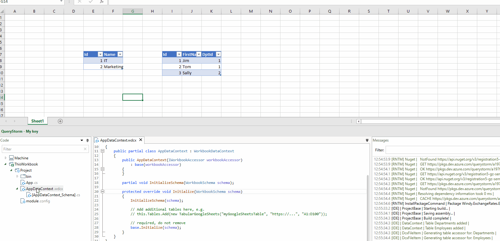
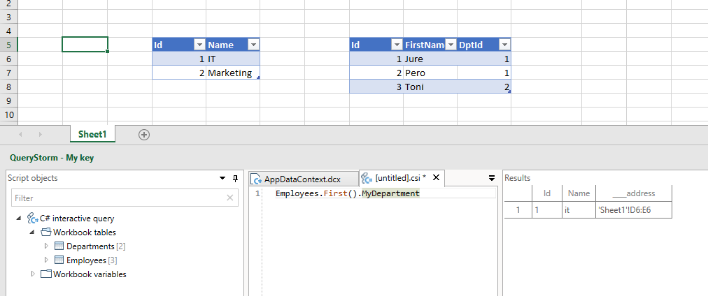

# The data context

The data context represents the outside world that scripts and components see. It exposes tables, variables and events.

When you create a script, a new instance of the data context is automatically created and passed to the script, making its data available to the script.

Components can access the data inside the context via property bindings, and component methods can handle events coming from the data context.

Each project can have no more than one data context file. You can define your own data context class to customize the data that will be available to your scripts and components, but if not, a default data context will be used.

## Defining a data context context file

The data context file can be added from the project's context menu.


This generates a data context file. You can use this file to add additional tables to your data context:

```csharp
using System;
using System.Collections.Generic;
using System.Linq;
using System.Text;
using QueryStorm.Core;
using static QueryStorm.Core.DebugHelpers;

namespace aa
{
	public partial class AppDataContext : DataContext
	{
		public AppDataContext() { }
		
		public override void Initialize()
		{
			// create a sample table
			var folder = Environment.GetFolderPath(Environment.SpecialFolder.MyDocuments);
			var listOfFiles = System.IO.Directory.GetFiles(folder);
		    var myFilesTbl = new TabularValue(listOfFiles, "myFiles");

		    // add it to the context
		    Tables.Add(myFilesTbl);
		}
	}
}
```

Adding the table to the `Tables` collection will make it available to your scripts and components. To use the new table in scripts, be sure to compile the project first (before starting the script).


## Generating table accessor types

Data contexts expose tables as implementations of the abstract class `Tabular`, which provides read and write access to tabular data. This data can represent a workbook table, a CSV file, a Google sheets table, data from some API, or any other data that can be represented as a table. Components can bind directly to `Tabular` instances that the data  context exposes:

```csharp
[BindTable]
public Tabular Departments { get; set; }
```

However, to get strongly typed access to the data inside the table, new types need to be created to wrap the Tabular instances and provide strongly typed properties for columns. The data context can generate those files automatically, via the "Recreate" context menu command:



Components can then bind to these strongly typed table wrappers:

```csharp
[BindTable]
public DepartmentsTable Departments { get; set; }
```

## The `WorkbookDataContext`

For workbook projects, a `WorkbookDataContext` is used to provide access to the workbook data:

- Excel tables are exposed as **tables**
- Single-cell named ranges are exposed as **variables**
- Workbook events (e.g. button click) are exposed as **events**

If you do not add a data context file to your project explicitly, an instance of `WorkbookDataContext` will be used implicitly to provide scripts and components access to workbook data.

However, adding a data context file to your project, allows you to:

- Customize column data types
- Add relationships between tables
- Register additional external tables
- Generate strongly typed accessors for tables

### The schema file

Excel does not provide a way to define column types for workbook tables, so the `WorkbookDataContext` has to guess at their types based on their content. It takes a fairly conservative guess but it might not guess the type you want. Furthermore, setting up table relationships also isn't supported in Excel.

To enable the user to configure column types as well as add table relations, an additional schema definition file is generated when adding a data context file for a workbook project:


This file contains a single method whose job it is to specify column types and table relationships.

For example:

``` csharp
protected override void Initialize(ContextSchema schema)
{
	schema.ConfigureTable("Person")
		// set column types
		.ConfigureColumn<System.Int32>("Id")
		.ConfigureColumn<System.String>("Name")
		.ConfigureColumn<System.DateTime>("DateOfBirth");
		// add table relation
		.AddRelation("DptId", To.One, "Departments", "Id", "MyDepartment");
}
```

Once the project is compiled, components and C# scripts will be able to see the changes in column types and use the new relation navigation properties. 

In the example above, a relation property `MyDepartment` was added to the `Person` table. In C# scripts it can use used like so:



The schema file can be edited by hand, as well as updated automatically when tables are changed in Excel.

When you add or remove workbook tables (or columns) in Excel, you can run the "Recreate" command on the data context to update the schema file. Configuration code for tables and columns will be added/removed, but settings for existing tables and columns will remain intact.

> Tip: for performance reasons (to avoid type conversions), it's slightly better to leave Id columns as `double` instead of `int`. This is because Excel does not have an `int` type; all numbers in Excel are `double`.

### Demo

Click below for a video demonstration of the concepts discussed in this segment:


