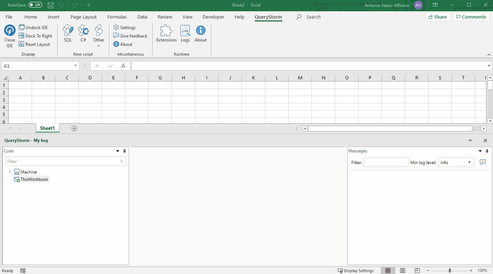
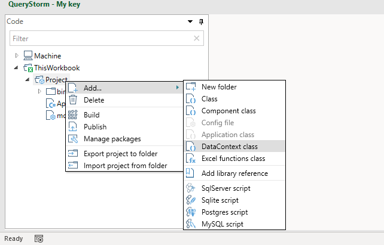
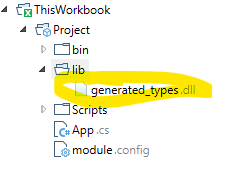

# Workbook automation with .NET

QueryStorm allows using C# and VB.NET to automate Excel workbooks.

It offers a model binding approach that is designed to minimize the amount of code that's needed to interact with Excel (though you can freely interact with Excel via its COM API as well).

Click below for a video example of the model-binding approach:


## Creating the project

To automate the workbook, we must first add a project to it:



This will create a project and prepare `module.config` and `app.cs` files that we can use as the starting point for our workbook application.

When this project is built, the output files (.dll and .manifest) will be stored inside the workbook, and the runtime will automatically load the project. Each time an Excel workbook is opened, the QueryStorm runtime inspects it to see if there's a **compiled** workbook application inside it. If it finds one, it loads it along with the workbook. When the workbook is closed, the application is unloaded with it.

## The `App` class

The workbook project has an `App` class that's defined in the `App.cs` (or `App.vb`) file. This is the entry point of the application.

In its constructor, we can request an `IWorkbookAccessor` instance which will give us access to the workbook that contains the application. We can use the workbook object to read and write cell values, subscribe to events, refresh graphs and pivot tables, etc.

For example, we can pop up a message box each time a cell is selected (though admittedly, this is not a very useful thing to do):

```csharp
public App(IUnityContainer container, IWorkbookAccessor workbookAccessor, IDialogService dialogService)
    : base(container)
{
    workbookAccessor.Workbook.SheetSelectionChange +=
        (sh,rng)=>
        {
            dialogService.ShowInfo(
                $"Selected cell {rng.Address} with value '{rng.Value}'",
                "Selected cell changed");
        };
}
```

In most cases, however, it's better to leave Excel interactions to QueryStorm's model binding infrastructure, and only use the COM API in special cases.

### Dependency injection

The constructor of the `App` class in the example above, accepts several parameters which are provided by the QueryStorm runtime via dependency injection. The `IWorkbookAccessor` service is used to access the workbook, and the `IDialogService` is used to display a message to the user.

Each workbook application is provided (by the QueryStorm runtime) its own IOC container, which comes pre-populated with some basic services. It is the responsibility of the `App` class to register any additional services that other parts of the application might need.

For example:

```csharp
public App(IUnityContainer container)
    : base(container)
{
    // register a service (as a singleton)
    container.RegisterType<SomeService>(new ContainerControlledLifetimeManager());
}
```

The IOC container is used to create instances of other classes, such as the data context, components, and function container classes, so all of those classes can accept dependencies via their constructors.

For example, a component can access a service via constructor injection, like so:

```csharp
public class Component1
{
    public Component1(SomeService someService)
    {
        // ...      
    }
}
```

> QueryStorm uses the [Unity container](http://unitycontainer.org/articles/introduction.html) for dependency injection.

## Components

A component class contains logic that controls a section of the workbook. You can have any number of components in a workbook, each controlling its own (arbitrarily defined) part of the workbook.

Components have the following characteristics:

- They can accept dependencies via constructor injection.
- Public properties of a component can be data-bound to cells in Excel via the `[Bind]` attribute and to tables via the `[BindTable]` attribute.
- The methods of the component can handle events coming from Excel (e.g. button click), which is specified using the `[EventHandler]` attribute.

For example, the following component reads a `searchText` parameter from a cell in Excel. Each time that cell's value changes, the component updates a table called `People` (by putting a star next to each name that contains the searchText), and writes a message into a cell named `messages`:

```csharp
using System;
using System.Collections.Generic;
using System.Linq;
using System.Windows.Forms;
using QueryStorm.Core;
using static QueryStorm.Core.DebugHelpers;

namespace Project
{
    public class Component1 : ComponentBase
    {
        [Bind("searchText")]
        public string SearchText { get; set; }
        
        [BindTable]
        public PeopleTable People{ get; set; }
        
        private string _Message;
        [Bind("messages")]
        public string Message
        {
            get => _Message;
            set { _Message = value; OnPropertyChanged(nameof(Message)); }
        }
        
        [EventHandler("searchText")]
        public void Test()
        {
            Message = $"Searched for '{SearchText}' at {DateTime.Now.ToShortTimeString()}";

            People.ForEach(t =>
            {
                string nameWithoutStar = t.FirstName.TrimEnd('*');
                if(t.FirstName.IndexOf(SearchText, StringComparison.OrdinalIgnoreCase) >= 0)
                    t.FirstName = nameWithoutStar + "*";
                else
                    t.FirstName = nameWithoutStar;
            });

            People.SaveChanges();
        }
    }
}
```

And here is the resulting behavior:


The important thing to note is that no part of the code interacts with Excel directly. The component only accesses its properties, and the binding infrastructure takes care of communicating with Excel.

## Bindings

Bindings allow you to read and write values from Excel without having to access Excel objects directly or subscribe to their events to listen for changes.

### Bindings and the data context

It's important to note that components aren't bound to Excel directly; they don't actually know anything about Excel. Instead, they are bound to a [data context](../../General/Data_context). For workbook applications, this data context happens to be a `WorkbookDataContext` instance that exposes data and events from the workbook.

You can customize this data context, by adding a data context file from the project's context menu:



The data context file allows you to:

- register additional tables
- override column types for workbook tables
- add relations between workbook tables

For more information about the data context, click [here](../../General/Data_context).

### Binding to cells

Component properties can be bound to cells in Excel. This is achieved by using the `[Bind(nameOfCell)]` attribute.

By default, bindings are bi-directional. When the user changes the value of a cell, any property that's bound to the cell also gets updated to the new value. On the other hand, when a component changes the value of one of its properties,
any cells that are bound to that property also get updated to the new value. For the binding infrastructure to detect the change, however, **the component should raise a `PropertyChanged` event** by calling e.g. `OnPropertyChange(nameof(MyProperty123))`. This is typically done in the setter of the property.

### Binding to tables

A component's property can also bind to an Excel table, which is done using the `[BindTable(tableName)]` attribute. This allows the component to read and update table data. In the previous example, we've used the following code to access the data in the `People` table:

```csharp
[BindTable]
public PeopleTable People{ get; set; }
```

You might be wondering where the `PeopleTable` class came from. The answer is: it was generated automatically. Each time you change any of the tables in your workbook, QueryStorm **dynamically generates a dll** with types that offer strongly typed access to the data they contain. This dll is then added to the `lib` folder of the project.



> The `generated_types.dll` file is also recreated after each successful build of the project, just in case you've customized the data context in the project.

The generated classes inside this dll provide strongly typed read/write access to data inside tables. It's important to note that any changes you make to the data **need to be explicitly saved** by calling `SaveChanges()` on the table.

> In C# scripts, `SaveChanges()` is called automatically after each run, but in model-binding, this call needs to be explicit.

## Events

Components can handle events coming in from the workbook by defining `public void` methods marked with the `EventHandler` attribute. Multiple `EventHandler` attributes can be applied to a method in case the same method should handle multiple events.

Currently, the following event sources are supported (by the `WorkbookDataContext`):

- ActiveX button (Click)
- Range (value changed)
- VBA (sent via the QueryStorm Runtime API)

The event name, which is the single argument to the `EventHandler` attribute, determines which event the method will handle.

### Handling button click events

When a method needs to handle the click of an ActiveX button, the following syntax should be used for the event name: `{sheetName}!{buttonName}`.

For example, to handle the click of an ActiveX button named `MyButton` located on a sheet named `Sheet1`, the method should be decorated as follows:

```csharp
[EventHandler("Sheet1!MyButton")]
public void MyEventHandlerMethod()
{
    // ...
}
```

### Handling range value changes

When a method needs to be called every time a range changes, the name of the range should be used as the event name:

```csharp
[EventHandler("nameOfTheCell")]
public void MyEventHandlerMethod()
{
    // ...
}
```

### Sending and handling events from VBA

Events can be sent from VBA code to the workbook application. This offers full flexibility with regard to sending events.

One particular reason this might be useful is that it allows using regular buttons to send events, instead of ActiveX buttons which have known issues when changing resolution (e.g. second screen, projector).

To send an event from VBA, use the `QueryStorm.Runtime.API` class, like so:

```csharp
CreateObject("QueryStorm.Runtime.API").SendEvent("myEvent")
```

Instances of the `QueryStorm.Runtime.API` class are lightweight objects that forward messages to the QueryStorm Runtime. They carry no state and do not need to be cached.

Handling the event is simple:

```csharp
[EventHandler("myEvent")]
public void MyEventHandlerMethod()
{
    // ...
}
```
