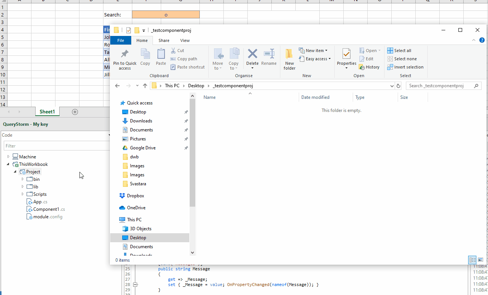

# Importing and exporting code

Workbook code can be exported to a folder on the local machine and later imported into another workbook (or the same workbook).

This can be useful for several purposes:

- reusing the code in multiple workbooks
- version controlling the source code
- protecting intellectual property by keeping only the output dlls in the workbook while keeping the source code only on your local machine.

The following gif illustrates the process of exporting a project and importing it into a new workbook:

