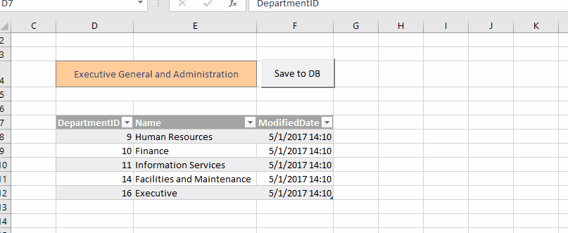

# Automating workbooks

Excel files offer data storage capabilities and a flexible user interface for data entry and visualization. However, Excel files aren't just static documents containing data; they can also have behavior, in effect, making the workbook a hybrid between a document and an application.

Out of the box, Microsoft Excel allows automating workbooks using VBA. However, VBA is quite old and hasn't kept up with the new programming paradigms and ecosystems. QueryStorm offers the ability to use modern programming languages as well as access to the .NET ecosystem when automating workbooks.

## Automation via .NET

QueryStorm lets you automate Excel using C# and VB.NET. Your classes can interact with the Excel API directly, but they can also use QueryStorm's model-binding API, which minimizes the amount of Excel interaction code and lets you focus on the logic of your application. In addition, your code can reference NuGet packages and existing .NET dlls, making it easy to use proprietary and 3rd party libraries in your workbook applications.

For more information about automation via .NET, click [here](../Automation_with_dotnet).

## SQL-based automation

QueryStorm also allows setting up automation from SQL scripts. These scripts typically contain SQL code extended with a simple preprocessor syntax. The job of the SQL code is to interact with the database, while the job of the preprocessor code is to interact with Excel, specifically, to send query results into the workbook and to specify which events will trigger the execution of the script.

For more information about automation via SQL, click [here](../Automation_with_SQL).
