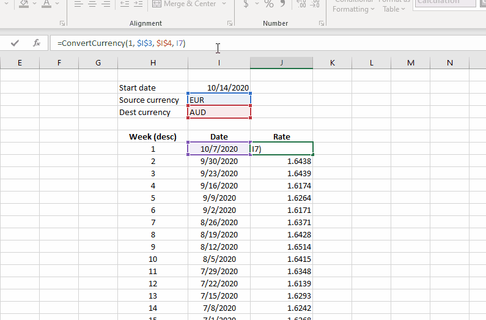
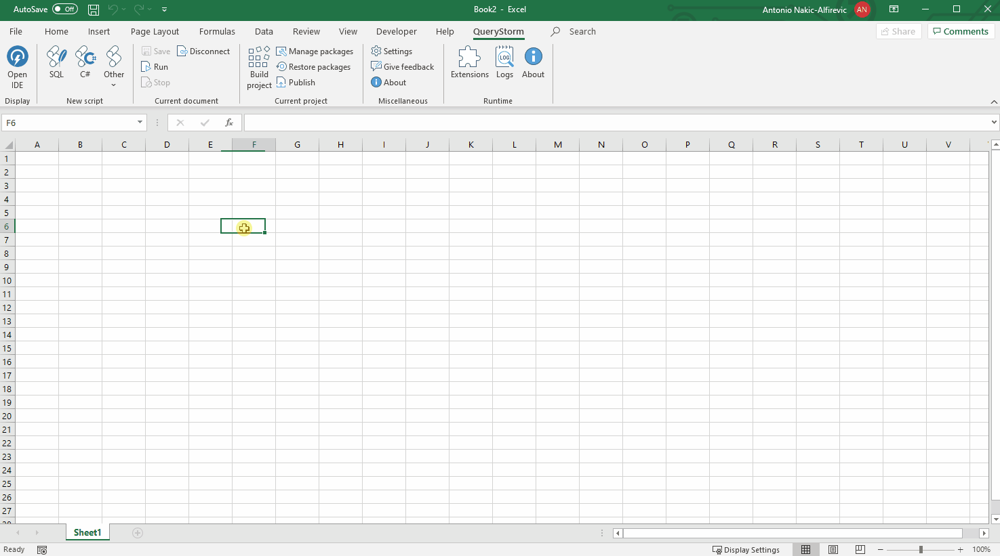
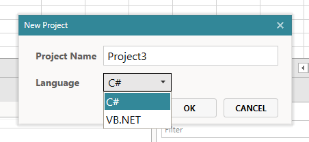

# Defining functions with .NET

The process of defining a function with C# or VB.NET is simply a matter of writing the function and decorating it with the `ExcelFunction` attribute.

```csharp
public class MyFunctions
{
    [ExcelFunction]
    public static int Add(int a, int b)
    {
        return a + b;
    }
}
```

## Loading the new function

Once the project that contains the function is built (compiled), the runtime will automatically load it and make the function available in Excel. Depending on if the function is in a workbook or an extension project, the function will be available in the defining workbook or all workbooks.

For a video demonstration click below:


## Async functions

Some functions can take a while to complete. This is often the case when the function fetches data from online sources. To allow Excel to remain responsive while the function is evaluating, the function should return `Task<T>`.

```csharp
[ExcelFunction]
public static async Task<string> ExampleAsync(int delay)
{
    var sw = new System.Diagnostics.Stopwatch();
    sw.Start();

    await Task.Delay(delay);

    return $"This function took {sw.ElapsedMilliseconds}ms to execute";
}
```

While the task is running, Excel will remain responsive and display #N/A as the (temporary) result of the function. Once the task completes, the final results it returned.

The image below shows an async function that converts currencies using a REST API.



> The `ConvertCurrency` function is available for download in the `Windy.ExchangeRates.ERA` QueryStorm extension package. It uses the [Fixer API](https://fixer.io/).

## Table-valued functions

Functions can return a single value or an entire table as their result.

If your machine (or the end user's machine) is running one of the newer (Office365) versions of Excel that support dynamic arrays, tabular results will automatically spill.



To return a table, your function's return type can be `object[,]`:

```csharp
[ExcelFunction]
public static object[,] GiveMeA2DArray()
{
    return new object[,] { {1,2}, {3,4}};
}
```

Alternatively, functions can also return `Tabular`, which is handy for functions that return database data:

```csharp
public class DatabaseSampleFunctions
{
    SqlServerEngineBuilder engineBuilder;
    public DatabaseSampleFunctions(SqlServerEngineBuilder engineBuilder)
    {
        // QueryStorm uses engines and engine builders for DB access
        this.engineBuilder = engineBuilder;
    }

    // this one returns Tabular
    [ExcelFunction]
    public Tabular GetSomeDataFromDatabase()
    {
        var sqlServerEngine = this.engineBuilder
            .WithConnectionString("...")
            .Build();

        return sqlServerEngine.Execute("select * from Department");
    }

    // this one is async and returns Task<Tabular>
    [ExcelFunction]
    public async Task<Tabular> GetSomeDataFromDatabaseAsync()
    {
        var sqlServerEngine = this.engineBuilder
            .WithConnectionString("...")
            .Build();

        return await sqlServerEngine.ExecuteAsync("select * from Department", CancellationToken.None);
    }
}
```

## ExcelDNA

QueryStorm uses the popular **ExcelDNA** library for registering Excel functions.

User code does not interact with ExcelDNA directly (for technical reasons - due to running in a separate AppDomain). However, any functionality that ExcelDna offers can very likely be surfaced by QueryStorm in future versions, so please feel free to get in touch for requests of this sort.

More information on ExcelDna, can be found in the following resources:

- [ExcelDna wiki on GitHub](https://github.com/Excel-DNA/ExcelDna/wiki)
- [ExcelDna documentation](https://docs.excel-dna.net/)
- [ExcelDna Google group](https://groups.google.com/g/exceldna/)
- [ExcelDna on StackOverflow](https://stackoverflow.com/questions/tagged/excel-dna)

## C# or VB.NET

When creating the project, you can choose which language to use:



The language setting is stored in the `module.config` file.

```json
"Language": "CSharp"
```

...or...

```json
"Language": "VisualBasic"
```

The language setting determines the compiler and class templates that the project will use. If you choose VB.NET, the code will be compiled using the VB.NET Roslyn compiler, and the scaffolded function files will look something like this:

```vb
Public Module MyFunctions1
        <ExcelFunction>
        Public Function Add(val1 As Int32, val2 As Int32) as int32
            return val1 + val2
        End Function
End Module
```

## Dependencies

Simple functions that do not rely on any shared dependencies can be static and do everything on their own.

However, a function might need to get hold of a particular service (e.g. an API object) in order to perform its calculation. That service might be expensive to create, so we would not want to create a new instance each time the function is evaluated. It would be better to have a single instance of the service which would be reused in each function call.

If the function relies on such dependencies, it should not be static. The constructor of the class that owns the function is executed only once (just before the first function call), so any expensive dependencies can be created there.

However, if multiple functions should share the same dependency, the dependency should be registered centrally, in the IOC container in the `App` class (inside the App.cs file). The constructor of the function's class can then request the service by simply declaring it as a constructor argument (constructor injection).

For example, we can register the service in App.cs:

```csharp
public App(IUnityContainer container)
    : base(container)
{
    // register the service as a singleton
    container.RegisterType<SomeService>(new ContainerControlledLifetimeManager());
}
```

We can then use the service in our function:

```csharp
public class ExcelFunctions1
{
    SomeService someService;
    // request the service by adding a ctor argument
    public ExcelFunctions1(SomeService someService)
    {
        this.someService = someService;
    }

    [ExcelFunction]
    public int Add(int a, int b)
    {
        // use the service to perform the calculation
        return someService.Add(a, b);
    }
}
```

> QueryStorm uses the [Unity container](http://unitycontainer.org/articles/introduction.html) for dependency injection.

## Debugging functions

QueryStorm does not currently have a built-in debugger, but there are two static methods that can help with debugging: `Log()` and `Debug()`.


### The `Log()` method

The simplest way to debug issues is to use the `Log(object obj)` method to print values to the messages pane.

The `Log()` method is contained in the `QueryStorm.Core.DebugHelpers` class. All class files that QueryStorm generates have a static *using* directive for that class, so you can use the `Log` method anywhere in your code, without qualifying it with the namespace or the class name.  

It's important to note that QueryStorm has two log viewers. One is part of the IDE, and the other is part of the Runtime (launched separately from the ribbon). The output of the `Log()` method will be visible in both places, so Runtime users will be able to see these messages.

### Attaching a debugger

The `Log()` method is useful, but quite often a proper debugger is needed to track down tricky bugs. QueryStorm compiles code in a debugger-friendly way, so it's fairly easy to debug your code with an external debugger.

To launch a debugger at a particular location in the source code, use the `Debug()` method. The `Debug()` method is also available anywhere in the code without prefixing it with the namespace or the class name, due to the `using` directive that's part of all code files generated by QueryStorm.

If the local machine has Visual Studio installed, the `Debug()` method will launch Visual Studio, attach it to the process and stop the debugger at the current line. If a debugger is already attached, it will simply stop at the line with the `Debug()` call.

If you do not have Visual Studio installed, you can use the small open-source [DNSpy](https://github.com/0xd4d/dnSpy) debugger, attach it to the Excel process, and use the `Debug()` method to stop the debugger at the desired line in the code.
