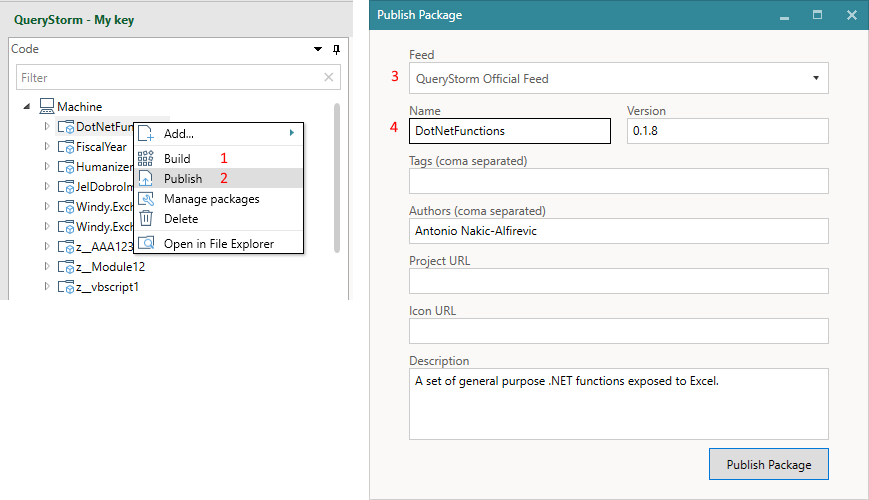

# Publishing packages

When an extension package is built (compiled), the functions it contains are immediately registered and available on the local machine. To make them available to other users, however, you need to publish the package.

To publish an extensions package, follow these steps:

1. Build the project
2. Right-click on the project and select "Publish"
3. Choose the feed to publish to
4. Enter information about the package

## Managing feeds (sources)

Before you can publish packages, though, you will likely need to set up a feed that you can publish to.

QueryStorm supports publishing to a network share or an online server. If you are distributing packages inside your network, a shared network folder would be a good place to store them. If you want to distribute packages to users outside of your local network (e.g. to your clients), you can publish the package to an online NuGet server, like Azure Artifacts ([instructions below](#publishing-to-azure-artifacts)).

In both cases, the feed needs to be added to your list of feeds before you can publish to it. The list of feeds is edited in the **Package Manager** or in the **Extensions manager** dialog as shown below. The dialog can be opened via the **Extensions** button in the QueryStorm ribbon, or via the **Manage packages** context menu for projects.

1. Tab for managing sources (feeds)
2. Button for editing the feed
3. Feed URL or path
4. Feed content type (Packages, Extensions or Both)

> Both creators and consumers use the above dialog to edit their package feeds.

## Publishing to a network share

Adding a network share as a source is fairly straightforward:

1. Click the "Add source" button to add a new source
2. Give the new source an arbitrary name
3. Enter the path to the network share in the "URL" field
4. Select "QueryStorm Extensions" in the "Feed type" field

Once that's done, you can publish your packages to this source. No credentials are required for publishing to a network share.

## Publishing to Azure artifacts

Azure Artifacts is a cloud-based package management solution that allows you to create and share NuGet packages via feeds that can be public or private.

Setting up a feed takes just a few minutes and is free of charge. Currently, the free plan allows for up to 2GB of storage, which is enough for thousands of packages and should be more than enough for most organizations. Should you need more space, scaling is quite easy and fairly affordable as well.

For a video of the process of setting up an Azure Artifacts feed, please click below:

### Creating the feed

To create an Azure artifacts feed, follow the steps below:

1. Go to http://dev.azure.com/ and create an account
2. After signing in, create a new project (**public**)
3. Select the Artifacts tab
4. Click "Create Feed" and give the feed a name
5. Click "Connect to Feed"
6. Click "Visual Studio" and copy the source link
7. Go to QueryStorm in Excel and add a new package source with the URL from the previous step

### Creating credentials

To be able to publish to this feed, you'll also need to set up a personal access token, which you can use as the password. To do so, follow these steps:

1. Click on the user settings in the top right corner of the page (in the azure webpage)
2. Select "Personal Access Token"
3. Set token expiration date
4. Grant the token full access
5. Copy the generated token
6. In QueryStorm, enter the token as the password of the feed and your email address (that's associated with your Azure account) as the username

That's it. You can now publish to your new feed! The only thing left to do is to share the feed URL with your users so they can add it to their list of sources.

## Updating packages

When publishing a new version of an existing package, make sure to **increment the version number**, otherwise, the server will report a collision with the version that is already on the server. If the repository is a network share, though, there will be no version checks.
