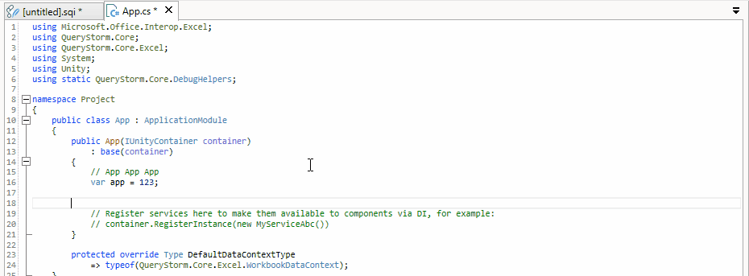

# IDE tips and tricks

This page lists some of the more useful and/or less obvious features of the IDE.

## Code editor

### Font size

Hold down ++ctrl++ while scrolling the mouse wheel to zoom in or out.

### Code completion

Code completion is automatic in QueryStorm, but you can also invoke it explicitly by pressing ++ctrl+space++.

### Code formatting

Messy code can be auto-formatted by pressing ++ctrl+shift+enter++.

### Go to matching bracket

Press `Ctrl+]` to navigate to the matching bracket. Hold down the ++shift++ key to also select everything in between.

### Go to symbol definition

Move the caret on top of a symbol, and press ++f12++ to navigate to the symbol definition. This can be in a different file.

### Rename symbol

Move the caret on top of a symbol and press ++f2++ to rename it. This works across all files in the same project.

### Star expansion (SQL)

Move the caret on top of a star symbol in the select list and invoke code-completion (++ctrl+space++) to expand the star into the columns it refers to.

> Column names are quoted if necessary.

### Column disambiguation (SQL)

Move the caret on top of an ambiguous symbol and invoke code-completion (++ctrl+space++) to disambiguate it.

> Column names are quoted if necessary.

### Find in file

Press ++ctrl+f++ to find a string inside the current file.

> Supports regular expressions.

### Replace in file

Press ++ctrl+h++ to replace occurences of string inside the current file.

> Supports regular expressions and replacement patterns.

### Move lines up or down

To move a line up or down, hold down the ++alt++ key while pressing ++up++ or ++down++ arrow keys.

### Code snippets

Use code snippets to write code faster. Use the ++tab++ key to navigate between snippet placeholders, press ++enter++ to complete the snippet.

> Snippets are language-specific, so depending on the current file, different snippets will be offered.

### Configure shortcut keys

Shortcut keys can be configured in the plugin settings

## Messages log

### Message tooltips

Hover over an item to see a tooltip with its full contents. This is particularly helpful for errors since they tend to include multiple lines of text.

### Navigate to an error in the source code

Double-click an error to navigate to its location in the source code.

> This does not work for errors that do not have source line information.

## Code explorer

### Find files and folders

To look for files and folders, use the filter box in the code explorer. Multiple search terms can be entered, separated by spaces. In order for a node to satisfy the filter, all search terms need to match the node or at least one of its ancestors.

> You can narrow down the search by entering one of the node's ancestors as a search term.
> If a folder satisfies the search criteria, all of its descendant nodes will also be visible.

### Find files with text

To find a file that contains specific text put the text in quotes.

> Text search can be combined with file/folder search, so you can, for example, look for files that contain the specified text but only inside a specific folder like so: `theFolder "text to search for"`

### Rename file

To rename a file, select it and press ++f2++. Press ++enter++ to accept the new name or ++esc++ to cancel.

> Files get their extension when they are created, subsequent changes to their extensions are not allowed.

### Move files and folders

Use drag and drop to move files and folders.

> Some files and folders will refuse to be moved (e.g. bin and lib)

## Object explorer

The object explorer shows items visible to scripts. Some of those items represent workbook tables, columns and ranges, and the object explorer allows you to interact with them.

### Go to workbook object

Go to a workbook object by holding ++ctrl++ and clicking the node in the object explorer.

### Rename workbook object

Press ++f2++ to rename a workbook table, column, or named range.

> Renaming database objects is currently not supported.

### Drop to editor

Drag and drop a node into the editor to insert its name. Hold down ++alt++ while dropping to insert all of the node's children's names instead.

> Names are quoted if needed.

## Results grid

### Sorting results

Click a column header to sort based on the column. Hold down ++ctrl++ and click a different column to include the column as a secondary (or tertiary, or...) sort criteria.

### Go to address in Excel

If a row in the results grid contains an address, double-clicking the address, or the row header will select the row in Excel. Select multiple rows and press space to select multiple rows in Excel.

